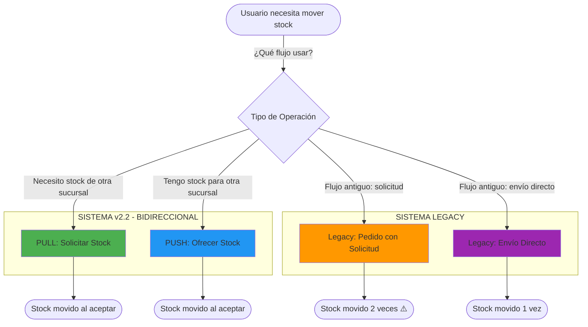
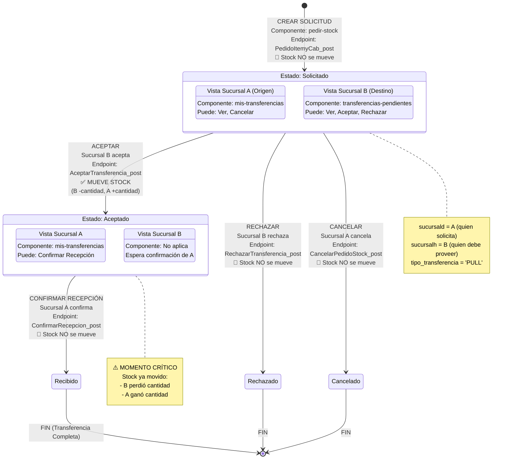
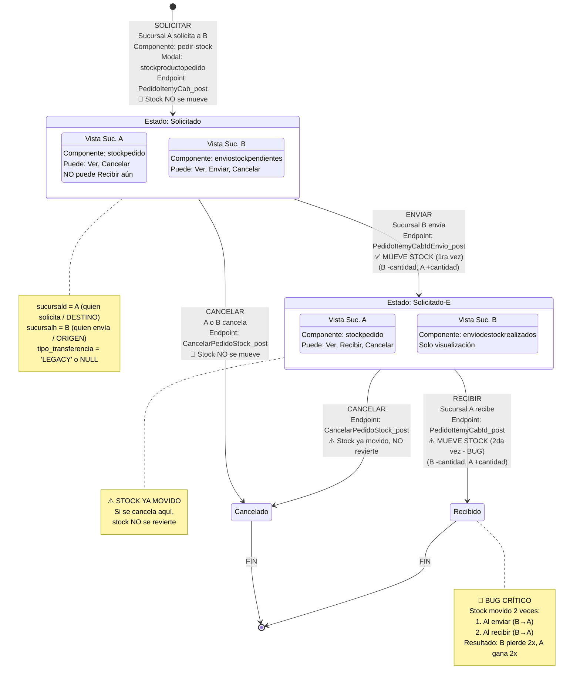
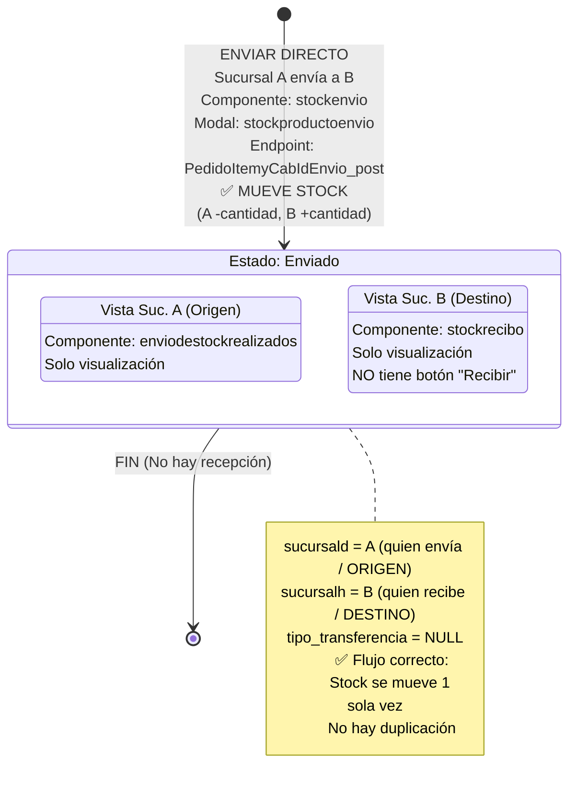
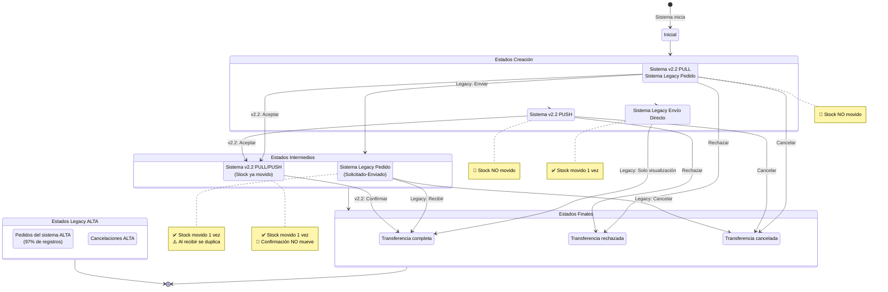
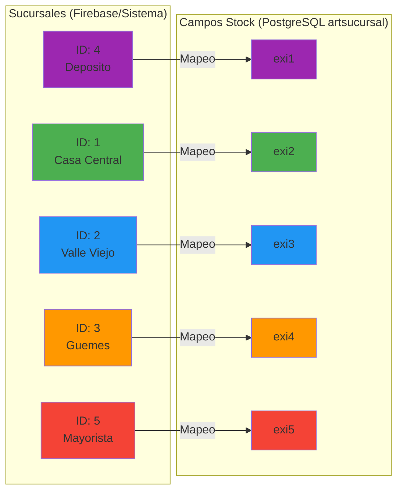
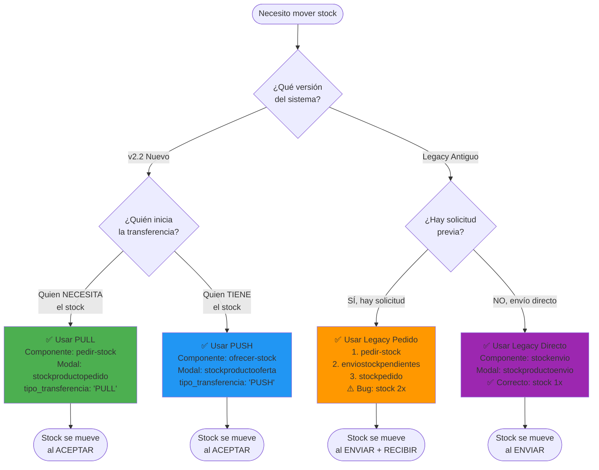

# Diagramas Completos: Flujos de Movimiento de Stock - MotoApp

**Fecha**: 16 de Noviembre de 2025
**Sistema**: MotoApp v2.2 + Legacy
**Analista**: Claude Code

---

## 📊 Índice de Diagramas

1. [Diagrama General de Flujos](#1-diagrama-general-de-flujos)
2. [Flujo PULL v2.2 (Solicitud de Stock)](#2-flujo-pull-v22-solicitud-de-stock)
3. [Flujo PUSH v2.2 (Oferta de Stock)](#3-flujo-push-v22-oferta-de-stock)
4. [Flujo Legacy: Pedido de Stock](#4-flujo-legacy-pedido-de-stock)
5. [Flujo Legacy: Envío Directo](#5-flujo-legacy-envío-directo)
6. [Diagrama de Estados Completo](#6-diagrama-de-estados-completo)
7. [Mapeo de Sucursales y Stock](#7-mapeo-de-sucursales-y-stock)

---

## 1. Diagrama General de Flujos

---

## 2. Flujo PULL v2.2 (Solicitud de Stock)

**Descripción**: Sucursal A solicita stock a Sucursal B. Solo se mueve stock cuando B acepta.

---

## 3. Flujo PUSH v2.2 (Oferta de Stock)

**Descripción**: Sucursal A ofrece stock a Sucursal B. Solo se mueve stock cuando B acepta.

---

## 4. Flujo Legacy: Pedido de Stock

**Descripción**: Flujo antiguo donde se solicita, se envía y se recibe. ⚠️ Stock se mueve DOS VECES (bug).

---

## 5. Flujo Legacy: Envío Directo

**Descripción**: Flujo antiguo de envío directo sin solicitud previa. Stock se mueve 1 vez (correcto).

---

## 6. Diagrama de Estados Completo

**Todos los estados posibles en el sistema**:

---

## 7. Mapeo de Sucursales y Stock

**Relación entre IDs de sucursales y campos de stock en la tabla `artsucursal`**:

**Tabla de Mapeo**:

| ID Sucursal | Nombre Sucursal | Campo Stock en BD | Nota |
|-------------|-----------------|-------------------|------|
| 1 | Casa Central | exi2 | ⚠️ No es exi1 |
| 2 | Valle Viejo | exi3 | ⚠️ No es exi2 |
| 3 | Guemes | exi4 | ⚠️ No es exi3 |
| 4 | Deposito | exi1 | ⚠️ No es exi4 |
| 5 | Mayorista | exi5 | ✅ Coincide |

---

## 8. Diagrama de Componentes y Endpoints

**Relación entre componentes Angular y endpoints PHP**:

```mermaid
graph TB
    subgraph "FRONTEND - Componentes Angular"
        direction TB

        subgraph "Sistema v2.2"
            PC1[pedir-stock<br/>stockproductopedido]
            PC2[ofrecer-stock<br/>stockproductooferta]
            PC3[transferencias-pendientes]
            PC4[mis-transferencias]
        end

        subgraph "Sistema Legacy"
            PL1[pedir-stock<br/>stockproductopedido]
            PL2[stockpedido]
            PL3[enviostockpendientes]
            PL4[enviodestockrealizados]
            PL5[stockenvio<br/>stockproductoenvio]
            PL6[stockrecibo]
        end
    end

    subgraph "BACKEND - Endpoints PHP (Descarga.php)"
        direction TB

        subgraph "Endpoints v2.2"
            E1[AceptarTransferencia_post<br/>Líneas 6966-7185]
            E2[RechazarTransferencia_post<br/>Líneas 7199-7325]
            E3[ConfirmarRecepcion_post<br/>Líneas 7338-7457]
            E4[ConfirmarEnvio_post<br/>Líneas 7470-7589]
        end

        subgraph "Endpoints Compartidos"
            ES1[PedidoItemyCab_post<br/>Líneas 1568-1712<br/>Crear solicitud/oferta]
            ES2[CancelarPedidoStock_post<br/>Líneas 2252-2273<br/>Cancelar]
        end

        subgraph "Endpoints Legacy"
            EL1[PedidoItemyCabIdEnvio_post<br/>Líneas 1928-2206<br/>Enviar]
            EL2[PedidoItemyCabId_post<br/>Líneas 1709-1927<br/>Recibir]
        end
    end

    subgraph "BACKEND - Endpoints PHP (Carga.php)"
        direction TB

        CG1[PedidoItemsPorSucursal_post<br/>Líneas 920-1054<br/>Obtener por sucursald]
        CG2[PedidoItemsPorSucursalh_post<br/>Líneas 1058-1207<br/>Obtener por sucursalh]
    end

    PC1 -->|POST crear PULL| ES1
    PC2 -->|POST crear PUSH| ES1
    PC3 -->|POST aceptar| E1
    PC3 -->|POST rechazar| E2
    PC4 -->|POST cancelar| ES2
    PC4 -->|POST confirmar recepción| E3
    PC4 -->|POST confirmar envío| E4
    PC4 -->|GET mis transferencias| CG1
    PC3 -->|GET transferencias pendientes| CG2

    PL1 -->|POST crear solicitud| ES1
    PL2 -->|GET solicitudes| CG1
    PL2 -->|POST recibir| EL2
    PL2 -->|POST cancelar| ES2
    PL3 -->|GET pendientes| CG2
    PL3 -->|POST enviar| EL1
    PL3 -->|POST cancelar| ES2
    PL4 -->|GET enviados| CG1
    PL5 -->|POST enviar directo| EL1
    PL6 -->|GET recibidos| CG2

    style PC1 fill:#4CAF50
    style PC2 fill:#2196F3
    style PC3 fill:#4CAF50
    style PC4 fill:#2196F3

    style E1 fill:#4CAF50
    style E2 fill:#F44336
    style E3 fill:#4CAF50
    style E4 fill:#2196F3

    style EL1 fill:#FF9800
    style EL2 fill:#9C27B0
```

---

## 9. Diagrama de Decisión: ¿Qué Flujo Usar?

---

## 10. Resumen de Momentos de Modificación de Stock

```mermaid
graph TB
    subgraph "Sistema v2.2 - CORRECTO"
        P1[PULL: Solicitado]
        P2[PULL: Aceptado]
        P3[PULL: Recibido]

        P1 -->|🔹 NO mueve stock| P2
        P2 -->|✅ MUEVE STOCK| P3
        P3 -->|🔹 NO mueve stock| P3End([FIN])

        U1[PUSH: Ofrecido]
        U2[PUSH: Aceptado]
        U3[PUSH: Recibido]

        U1 -->|🔹 NO mueve stock| U2
        U2 -->|✅ MUEVE STOCK| U3
        U3 -->|🔹 NO mueve stock| U3End([FIN])
    end

    subgraph "Sistema Legacy"
        L1[Pedido: Solicitado]
        L2[Pedido: Solicitado-E]
        L3[Pedido: Recibido]

        L1 -->|🔹 NO mueve stock| L2
        L2 -->|✅ MUEVE STOCK 1ra vez| L3
        L3 -->|⚠️ MUEVE STOCK 2da vez BUG| L3End([FIN])

        D1[Directo: Enviado]

        D1 -->|✅ MUEVE STOCK 1 vez| D1End([FIN])
    end

    style P2 fill:#4CAF50
    style U2 fill:#2196F3
    style L2 fill:#FF9800
    style L3 fill:#F44336
    style D1 fill:#9C27B0
```

---

## 📝 Notas Importantes

### Diferencias Clave entre Sistemas

| Aspecto | Sistema v2.2 | Sistema Legacy |
|---------|-------------|----------------|
| **Momento de stock** | Al ACEPTAR (1 vez) ✅ | Al ENVIAR y RECIBIR (2 veces) ❌ |
| **Estados** | Solicitado/Ofrecido → Aceptado → Recibido | Solicitado → Solicitado-E → Recibido |
| **Cancelación** | Antes de aceptar ✅ | Antes de enviar, o después (sin revertir stock) ⚠️ |
| **Rechazo** | Con motivo obligatorio ✅ | No existe |
| **Confirmación** | Opcional (solo cambia estado) | Duplica stock ❌ |
| **Tipo transferencia** | 'PULL' o 'PUSH' | 'LEGACY' o NULL |

### Problemas Identificados

1. **🚨 CRÍTICO - Legacy Pedido**: Stock se duplica (envío + recepción)
2. **⚠️ MEDIO - Legacy Cancelación**: No revierte stock si ya fue enviado
3. **⚠️ BAJO - Semántica Invertida**: `sucursald`/`sucursalh` significan cosas opuestas entre flujos

### Recomendaciones

1. **Migrar a v2.2**: Usar sistema PULL/PUSH para nuevas transferencias
2. **Mantener Legacy**: Solo para compatibilidad con transferencias antiguas
3. **NO usar Legacy Pedido**: Tiene bug de duplicación de stock
4. **Documentar**: Indicar claramente cuándo usar cada flujo

---

**Fecha de Creación**: 16 de Noviembre de 2025
**Sistema**: MotoApp v2.2 + Legacy
**Estado**: ✅ Diagramas Completos
**Analista**: Claude Code
