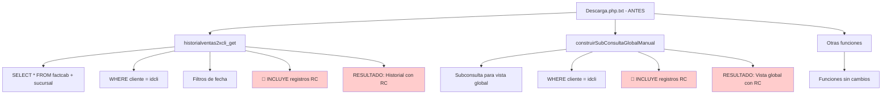

# Diagramas Mermaid - Cambios en Backend para Filtrado RC

## 1. Descarga.php.txt - ANTES de la Modificación



## 2. Descarga.php.txt - DESPUÉS de la Modificación

```mermaid
graph TD
    A[Descarga.php.txt - DESPUÉS] --> B[✨ NUEVAS Funciones Helper]
    A --> C[historialventas2xcli_get - MODIFICADA]
    A --> D[construirSubConsultaGlobalManual - MODIFICADA]
    A --> E[Otras funciones]
    
    B --> B1[aplicarFiltroSinRC]
    B --> B2[aplicarFiltroSoloRC]
    B1 --> B3[WHERE tipo != 'RC']
    B2 --> B4[WHERE tipo = 'RC']
    
    C --> C1[SELECT * FROM factcab + sucursal]
    C --> C2[WHERE cliente = idcli]
    C --> C3[✅ aplicarFiltroSinRC('f')]
    C --> C4[Filtros de fecha]
    C --> C5[🟢 EXCLUYE registros RC]
    C --> C6[RESULTADO: Historial SIN RC]
    
    D --> D1[Subconsulta para vista global]
    D --> D2[WHERE cliente = idcli]
    D --> D3[✅ AND tipo != 'RC']
    D --> D4[🟢 EXCLUYE registros RC]
    D --> D5[RESULTADO: Vista global SIN RC]
    
    E --> E1[Funciones sin cambios]
    
    style B1 fill:#ccffcc
    style B2 fill:#ccffcc
    style C3 fill:#ccffcc
    style C5 fill:#ccffcc
    style C6 fill:#ccffcc
    style D3 fill:#ccffcc
    style D4 fill:#ccffcc
    style D5 fill:#ccffcc
```

## 3. Carga.php.txt - ANTES de la Modificación

```mermaid
graph TD
    A[Carga.php.txt - ANTES] --> B[cabecerax_post]
    A --> C[CabecerasucNombreTarj_post]
    A --> D[cabecera_post]
    A --> E[Otras funciones]
    
    B --> B1[SELECT * FROM factcab + sucursal]
    B --> B2[WHERE cliente = idcli]
    B --> B3[WHERE saldo != 0]
    B --> B4[🔴 INCLUYE registros RC]
    B --> B5[RESULTADO: Cabeceras con RC]
    
    C --> C1[SELECT con JOIN tarjetas]
    C --> C2[WHERE condiciones básicas]
    C --> C3[🔴 INCLUYE registros RC]
    C --> C4[RESULTADO: Cabeceras con tarjeta + RC]
    
    D --> D1[SELECT * FROM factcab + sucursal]
    D --> D2[WHERE condiciones generales]
    D --> D3[🔴 INCLUYE registros RC]
    D --> D4[RESULTADO: Consulta general + RC]
    
    E --> E1[Funciones de inserción]
    E --> E2[Funciones sin cambios]
    
    style B4 fill:#ffcccc
    style B5 fill:#ffcccc
    style C3 fill:#ffcccc
    style C4 fill:#ffcccc
    style D3 fill:#ffcccc
    style D4 fill:#ffcccc
```



## 4. Carga.php.txt - DESPUÉS de la Modificación

```mermaid
graph TD
    A[Carga.php.txt - DESPUÉS] --> B[cabecerax_post - MODIFICADA]
    A --> C[CabecerasucNombreTarj_post - MODIFICADA]
    A --> D[cabecera_post - MODIFICADA]
    A --> E[Otras funciones]
    
    B --> B1[SELECT * FROM factcab + sucursal]
    B --> B2[WHERE cliente = idcli]
    B --> B3[WHERE saldo != 0]
    B --> B4[✅ aplicarFiltroSinRC()]
    B --> B5[🟢 EXCLUYE registros RC]
    B --> B6[RESULTADO: Cabeceras SIN RC]
    
    C --> C1[SELECT con JOIN tarjetas]
    C --> C2[WHERE condiciones básicas]
    C --> C3[✅ aplicarFiltroSinRC(tabla)]
    C --> C4[🟢 EXCLUYE registros RC]
    C --> C5[RESULTADO: Cabeceras con tarjeta SIN RC]
    
    D --> D1[SELECT * FROM factcab + sucursal]
    D --> D2[WHERE condiciones generales]
    D --> D3[✅ aplicarFiltroSinRC()]
    D --> D4[🟢 EXCLUYE registros RC]
    D --> D5[RESULTADO: Consulta general SIN RC]
    
    E --> E1[Funciones de inserción]
    E --> E2[✅ Siguen insertando RC]
    E --> E3[Funciones sin cambios]
    
    style B4 fill:#ccffcc
    style B5 fill:#ccffcc
    style B6 fill:#ccffcc
    style C3 fill:#ccffcc
    style C4 fill:#ccffcc
    style C5 fill:#ccffcc
    style D3 fill:#ccffcc
    style D4 fill:#ccffcc
    style D5 fill:#ccffcc
    style E2 fill:#ffffcc
```

## Resumen de Cambios

### 🔴 ANTES: Problemas Identificados
- **Descarga.php.txt**: Historial de ventas incluía registros RC
- **Carga.php.txt**: Consultas de cabeceras incluían registros RC
- **Resultado**: RC aparecían en reportes de facturación

### 🟢 DESPUÉS: Solución Implementada
- **Funciones Helper**: `aplicarFiltroSinRC()` y `aplicarFiltroSoloRC()`
- **Filtros Aplicados**: 5 funciones críticas ahora excluyen RC
- **Referencias Intactas**: Inserción de RC se mantiene para dependencias
- **Resultado**: RC no aparecen en reportes, pero referencias funcionan

### ✅ Beneficios
1. **Separación Lógica**: RC no aparecen en consultas de facturación
2. **Integridad**: Referencias `recibos.id_fac`, `caja_movi.num_operacion`, `psucursal.id_num` intactas
3. **Consistencia**: Filtrado uniforme con funciones helper
4. **Reversibilidad**: Fácil de revertir si es necesario