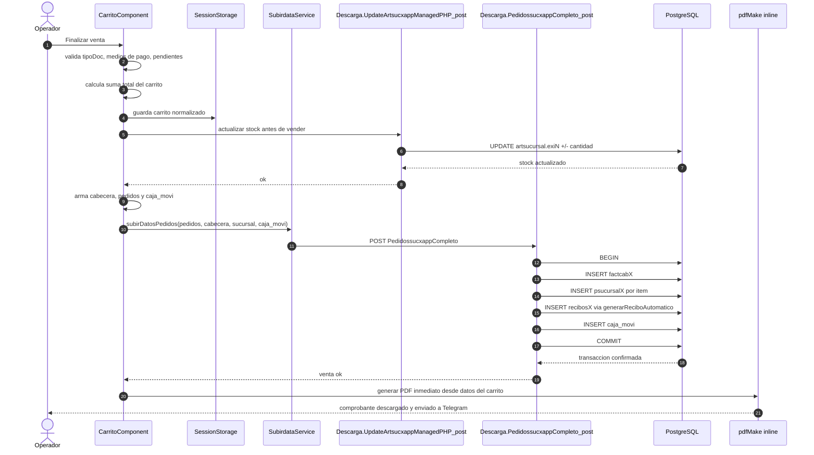
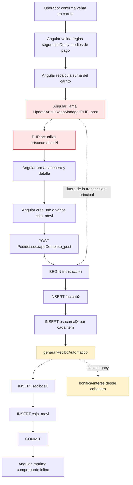
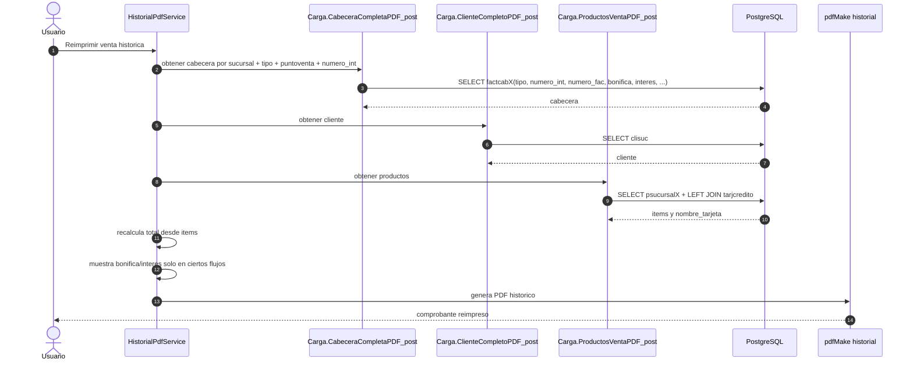
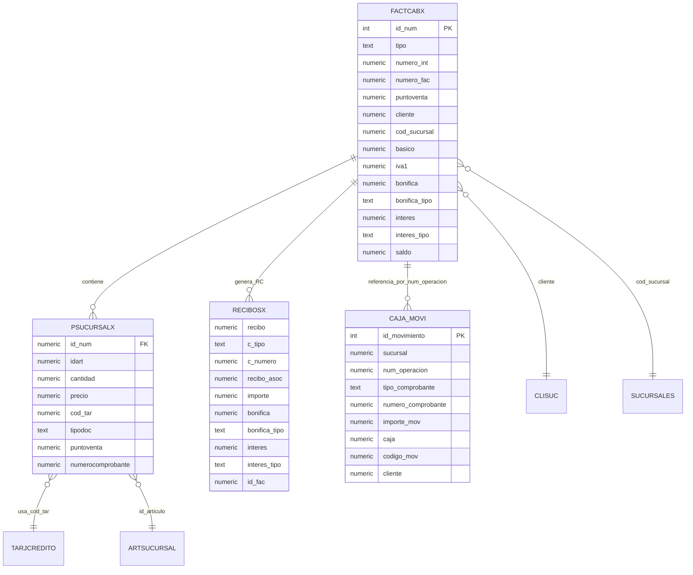
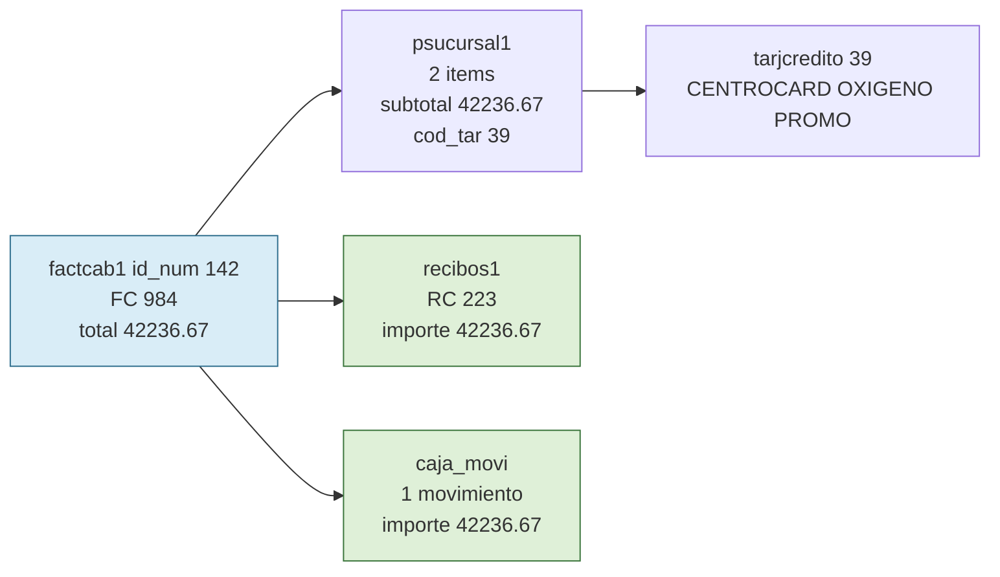
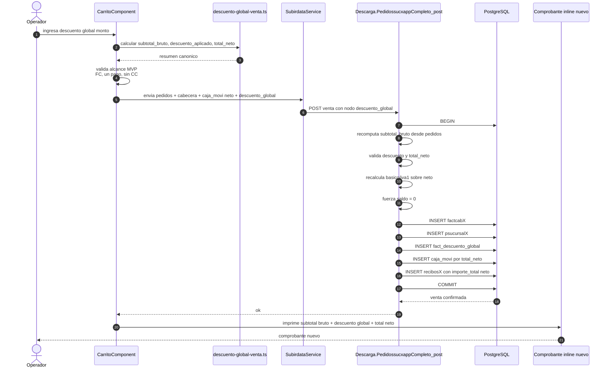
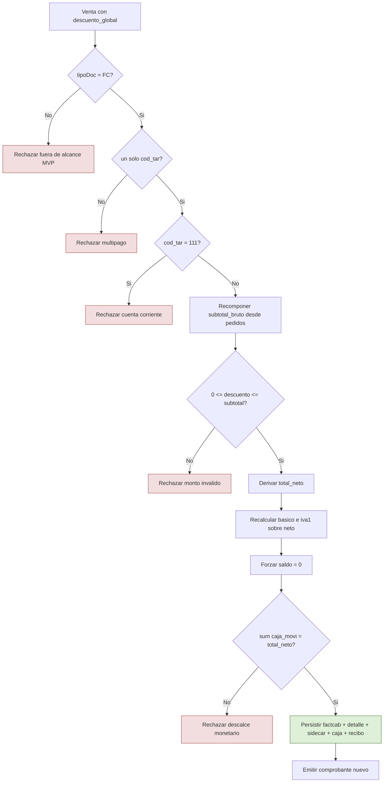
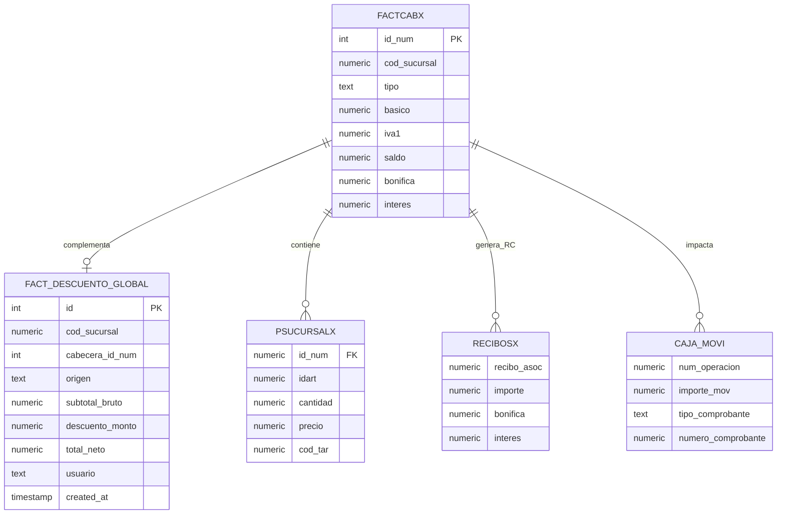
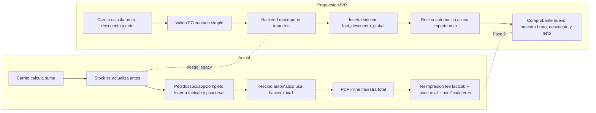

# Diagramas: MotoApp venta a comprobante y propuesta descuento global separado

## Objetivo

Este documento muestra en Mermaid:

- el flujo actual real desde `carrito` hasta la generacion de comprobante
- los puntos donde intervienen Angular, PHP espejo y PostgreSQL
- la propuesta del plan `specs-motoapp-descuento-global-separado-20260420-095556`
- las diferencias operativas y de datos entre el flujo actual y el MVP propuesto

## Evidencia usada

- Frontend Angular: `src/app/components/carrito/carrito.component.ts`, `src/app/services/subirdata.service.ts`, `src/app/services/historial-pdf.service.ts`
- Backend PHP espejo: `src/Descarga.php.txt`, `src/Carga.php.txt`
- Plan objetivo: `specs-motoapp-descuento-global-separado-20260420-095556/plan-tecnico.md`, `specs-motoapp-descuento-global-separado-20260420-095556/spec-backend.md`, `specs-motoapp-descuento-global-separado-20260420-095556/spec-frontend.md`
- Base real via MCP Postgres: tablas `factcab*`, `psucursal*`, `recibos*`, `caja_movi`, `tarjcredito`, `artsucursal`, `clisuc`, `sucursales`

## Hallazgos base confirmados

- El stock hoy se descuenta antes del endpoint de venta mediante `UpdateArtsucxappManagedPHP_post()`.
- La venta principal se persiste en `PedidossucxappCompleto_post()`.
- Ese write-path inserta `factcabX`, luego `psucursalX`, luego genera `recibosX`, luego `caja_movi`.
- `generarReciboAutomatico()` hoy calcula `importe_total = basico + iva1` y copia `bonifica/interes` legacy.
- `CabeceraCompletaPDF_post()` hoy no devuelve `id_num`; expone `bonifica/interes` pero no tiene sidecar de descuento global.
- En DB real no existe hoy `public.fact_descuento_global`.
- Caso real `factcab1.id_num = 142`: total cabecera `42236.67`, detalle `42236.67`, recibo `42236.67`, caja `42236.67`.
- Existen ventas multipago reales en DB, por ejemplo `factcab1.id_num = 90`, por eso el plan restringe el MVP nuevo.

## 1. Flujo actual end-to-end de venta hasta comprobante
Explica el recorrido real actual desde la UI del carrito hasta la persistencia y la emision inmediata del comprobante.

Observaciones:
El comprobante inmediato sale del frontend y no relee la venta desde backend. El stock queda adelantado respecto de la transaccion principal. La venta actual no usa una estructura separada para descuento global.

## 2. Write-path actual y orden real de persistencia
Muestra el orden exacto del flujo actual y donde queda el riesgo legacy de stock fuera de la transaccion principal.

Observaciones:
Si la venta falla despues del update de stock, el descuento de stock ya ocurrio. `generarReciboAutomatico()` hoy tiene manejo tolerante al error y sigue semantica legacy de `bonifica/interes`.

## 3. Flujo actual de reimpresion y PDF historico
Explica como hoy se rearma un comprobante historico y por que el backend de lectura no alcanza para un descuento global separado.

Observaciones:
`CabeceraCompletaPDF_post()` hoy selecciona `bonifica`, `bonifica_tipo`, `interes`, `interes_tipo`, pero no `id_num`. Sin `id_num` no hay lookup natural a un sidecar por cabecera en la reimpresion MVP/Fase 2.

## 4. Modelo actual de datos involucrado en venta y comprobante
Resume las entidades actuales que participan del flujo real de venta y emision.

Observaciones:
La cabecera actual concentra total fiscal y campos legacy. No existe hoy una entidad propia para descuento global de venta. El vinculo mas estable para una estructura auxiliar nueva es `cod_sucursal + id_num`.

## 5. Caso real actual confirmado en base
Ejemplifica el flujo actual con una venta real y consistente de la sucursal 1.

Observaciones:
En este caso, cabecera, detalle, recibo y caja cierran exactamente. Es el patron que el plan busca conservar, pero agregando un descuento separado y auditable.

## 6. Propuesta del plan: venta con descuento global separado
Muestra el flujo target del plan para el MVP estrecho: `FC`, contado simple, un medio de pago, sin `cod_tar = 111`.

Observaciones:
La propuesta no reutiliza `bonifica/interes`. La insercion del sidecar participa en la misma transaccion y si falla debe abortar la venta completa.

## 7. Guardrails del MVP propuesto
Resume las validaciones positivas y los rechazos explicitos definidos por el plan para reducir riesgo fiscal y contable.

Observaciones:
El plan no habilita el descuento en `NC`, `ND`, `NV`, `PR`, `CS`, cuenta corriente ni multipago. Eso esta alineado con los riesgos abiertos de `basico/iva1`, `saldo` y `recibo automatico`.

## 8. Modelo target con sidecar de descuento global
Explica la estructura separada propuesta para no contaminar `factcab*` ni `recibos*` legacy.

Observaciones:
La relacion propuesta es 1:1 por venta. `fact_descuento_global` guarda la verdad canonica del bruto, descuento y neto, mientras `bonifica/interes` quedan reservados para su uso historico actual.

## 9. Comparacion visual: actual vs propuesta
Contrasta rapidamente los cambios funcionales mas importantes entre ambos recorridos.

Observaciones:
La propuesta agrega una segunda verdad auditable para el descuento, pero evita reescribir la semantica de los campos legacy. La principal deuda que permanece en el MVP es el stock descontado antes del endpoint principal.

## Resumen de cobertura

| # | Diagrama | Dominio | Tipo Mermaid |
|---|----------|---------|-------------|
| 1 | Flujo actual end-to-end de venta hasta comprobante | Comportamiento | Sequence |
| 2 | Write-path actual y orden real de persistencia | Comportamiento | Flowchart |
| 3 | Flujo actual de reimpresion y PDF historico | Comportamiento | Sequence |
| 4 | Modelo actual de datos involucrado en venta y comprobante | Datos | ER |
| 5 | Caso real actual confirmado en base | Datos / comportamiento | Flowchart |
| 6 | Propuesta del plan: venta con descuento global separado | Comportamiento | Sequence |
| 7 | Guardrails del MVP propuesto | Reglas / seguridad funcional | Flowchart |
| 8 | Modelo target con sidecar de descuento global | Datos | ER |
| 9 | Comparacion visual: actual vs propuesta | Arquitectura de flujo | Flowchart |
