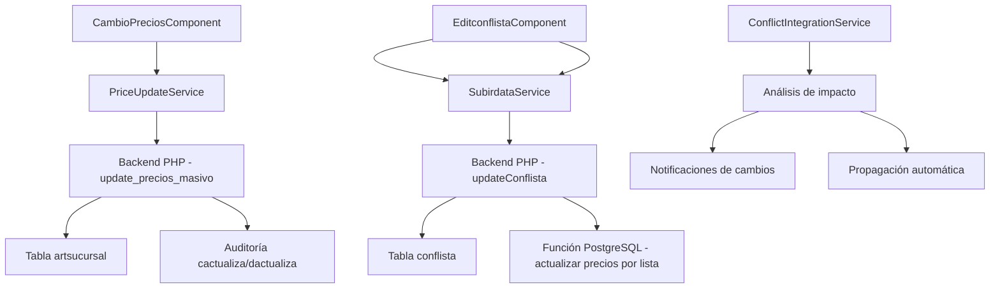

# Integración Modificación de Precios con Conflista
## Documento Técnico de Arquitectura e Implementación

---

## 1. RESUMEN EJECUTIVO

### 1.1 Situación Actual
El sistema MotoApp cuenta con dos módulos independientes:
- **Sistema cambioprecios**: Permite modificación masiva de precios por filtros (marca, proveedor, rubro, IVA)
- **Sistema conflista**: Gestiona listas de precios con configuraciones específicas por marca

Actualmente funcionan de manera aislada, requiriendo intervención manual para sincronizar cambios entre ambos sistemas.

### 1.2 Objetivo del Proyecto
Integrar ambos sistemas para que las modificaciones masivas de precios se propaguen automáticamente a las conflistas correspondientes, manteniendo la consistencia de precios en todo el sistema.

### 1.3 Beneficios Esperados
- **Consistencia automática** entre precios masivos y listas específicas
- **Reducción de errores** por sincronización manual
- **Eficiencia operativa** mediante proceso unificado
- **Auditoría completa** de todos los cambios de precios
- **Flexibilidad** para aplicar o no cambios a conflistas específicas

### 1.4 Tiempo y Recursos Estimados
- **Duración estimada**: 3-4 semanas de desarrollo
- **Recursos**: 1 desarrollador full-stack senior
- **Fases**: Backend (40%), Frontend (35%), Testing (25%)

---

## 2. ANÁLISIS DE SITUACIÓN ACTUAL

### 2.1 Estado del Sistema Cambioprecios

#### Funcionalidad Actual
```typescript
// Componente: CambioPreciosComponent
// Funcionalidades principales:
- Filtrado por un solo criterio (marca, proveedor, rubro, IVA)
- Preview de cambios antes de aplicar
- Modificación de precio de costo o precio final
- Sistema de auditoría en tablas cactualiza/dactualiza
```

#### Estructura de Base de Datos Involucrada
```sql
-- Tabla principal de productos
artsucursal: 
  - precostosi (precio de costo)
  - precon (precio final)
  - marca, cd_proveedor, rubro, cod_iva

-- Auditoría de cambios masivos  
cactualiza: cabecera de actualización masiva
dactualiza: detalle de productos modificados
```

#### Proceso Manual Actual
1. Usuario selecciona filtros en cambioprecios
2. Sistema genera preview de productos afectados  
3. Usuario aplica cambios masivos
4. Sistema actualiza artsucursal y registra auditoría
5. **MANUAL**: Usuario debe verificar y ajustar conflistas manualmente

### 2.2 Estado del Sistema Conflista

#### Funcionalidad Actual
```typescript
// Componentes: NewconflistaComponent, EditconflistaComponent
// Funcionalidades principales:
- Gestión individual de listas por marca
- Configuración de porcentajes (preciof21, preciof105)
- Actualización automática de productos por lista
```

#### Estructura de Base de Datos Involucrada
```sql
-- Tabla de configuración de listas
conflista:
  - listap (número de lista 1-4)
  - preciof21, preciof105 (porcentajes por tipo IVA)
  - cod_marca, activa, rmargen
  - tipo de moneda, descuentos

-- Proceso de actualización automática por función PostgreSQL
```

#### Problemas Identificados
- **Desconexión**: Los cambios masivos no consideran conflistas existentes
- **Inconsistencias**: Precios base cambian pero conflistas mantienen porcentajes obsoletos
- **Proceso manual**: Requiere verificación y ajuste posterior
- **Sin visibilidad**: No hay alertas sobre conflistas afectadas

---

## 3. ARQUITECTURA TÉCNICA DETALLADA

### 3.1 Diagrama de Componentes Involucrados



### 3.2 Estructura de Base de Datos Relevante

#### Tablas Principales
```sql
-- Productos con precios
artsucursal (
    id_articulo INTEGER,
    cd_articulo INTEGER,
    nomart TEXT,
    precostosi NUMERIC,  -- Precio de costo
    precon NUMERIC,      -- Precio final
    marca TEXT,
    cd_proveedor TEXT,
    rubro TEXT,
    cod_iva INTEGER,
    cod_deposito INTEGER
);

-- Configuración de listas de precios
conflista (
    id_conflista INTEGER PRIMARY KEY,
    listap INTEGER,      -- Número de lista (1-4)
    cod_marca TEXT,      -- Código de marca
    preciof21 NUMERIC,   -- Porcentaje IVA 21%
    preciof105 NUMERIC,  -- Porcentaje IVA 10.5%
    activa BOOLEAN,
    rmargen BOOLEAN,
    tipomone INTEGER,
    fecha DATE
);

-- Auditoría de cambios masivos
cactualiza (
    id_act INTEGER PRIMARY KEY,
    tipo TEXT,
    porcentaje_21 NUMERIC,
    fecha TIMESTAMP,
    usuario TEXT,
    id_marca INTEGER,
    id_proveedor INTEGER,
    id_rubro INTEGER
);

-- Detalle de productos modificados
dactualiza (
    id_act INTEGER,
    id_articulo INTEGER,
    articulo INTEGER,
    nombre TEXT,
    pcosto NUMERIC,      -- Precio costo anterior
    pcoston NUMERIC,     -- Precio costo nuevo
    pfinal NUMERIC,      -- Precio final anterior
    pfinaln NUMERIC      -- Precio final nuevo
);
```

#### Nueva Tabla Propuesta
```sql
-- Tabla para registrar impacto en conflistas
conflista_impacto (
    id_impacto SERIAL PRIMARY KEY,
    id_act INTEGER REFERENCES cactualiza(id_act),
    id_conflista INTEGER REFERENCES conflista(id_conflista),
    accion TEXT CHECK (accion IN ('notificado', 'aplicado', 'omitido')),
    porcentaje_anterior NUMERIC,
    porcentaje_nuevo NUMERIC,
    productos_afectados INTEGER,
    fecha_procesamiento TIMESTAMP DEFAULT NOW(),
    observaciones TEXT
);
```

### 3.3 Flujo de Datos Actual

#### Cambio de Precios Masivo (Actual)
```
Frontend (filtros) → PriceUpdateService → Backend PHP → 
update_precios_masivo() → artsucursal + auditoría
```

#### Actualización de Conflista (Actual)
```
Frontend (configuración) → SubirdataService → Backend PHP → 
updateConflista() → función PostgreSQL → artsucursal
```

### 3.4 Puntos de Integración Identificados

1. **Punto de detección**: Función `update_precios_masivo()` 
2. **Análisis de impacto**: Identificar conflistas afectadas por filtros aplicados
3. **Notificación**: Sistema de alertas sobre conflistas que requieren atención
4. **Propagación opciónal**: Aplicación automática de cambios a conflistas seleccionadas

---

## 4. SOLUCIÓN PROPUESTA

### 4.1 Arquitectura de la Solución

La integración se implementará mediante un **sistema híbrido** que combina:
- **Detección automática** de conflistas afectadas
- **Opciones de propagación** configurables por el usuario
- **Auditoría completa** de todos los cambios aplicados

### 4.2 Modificaciones Requeridas en el Backend

#### 4.2.1 Nueva Función PostgreSQL
```sql
CREATE OR REPLACE FUNCTION analizar_impacto_conflistas(
    p_marca TEXT DEFAULT NULL,
    p_cd_proveedor INTEGER DEFAULT NULL,  
    p_rubro TEXT DEFAULT NULL,
    p_cod_iva INTEGER DEFAULT NULL,
    p_tipo_modificacion TEXT DEFAULT 'costo',
    p_porcentaje NUMERIC DEFAULT 0
) RETURNS TEXT AS $$
DECLARE
    conflista_record RECORD;
    productos_afectados INTEGER;
    resultado JSON := '[]'::JSON;
    temp_result JSON;
BEGIN
    -- Analizar cada conflista activa que pueda verse afectada
    FOR conflista_record IN 
        SELECT id_conflista, listap, cod_marca, preciof21, preciof105, activa
        FROM conflista 
        WHERE activa = true
        AND (p_marca IS NULL OR cod_marca = p_marca)
    LOOP
        -- Contar productos que se verían afectados
        SELECT COUNT(*) INTO productos_afectados
        FROM artsucursal a
        WHERE (p_marca IS NULL OR marca = p_marca)
        AND (p_cd_proveedor IS NULL OR cd_proveedor::text = p_cd_proveedor::text)
        AND (p_rubro IS NULL OR rubro = p_rubro)  
        AND (p_cod_iva IS NULL OR cod_iva = p_cod_iva)
        AND marca = conflista_record.cod_marca;
        
        -- Solo incluir si hay productos afectados
        IF productos_afectados > 0 THEN
            temp_result := json_build_object(
                'id_conflista', conflista_record.id_conflista,
                'listap', conflista_record.listap,
                'cod_marca', conflista_record.cod_marca,
                'productos_afectados', productos_afectados,
                'preciof21_actual', conflista_record.preciof21,
                'preciof105_actual', conflista_record.preciof105,
                'porcentaje_cambio', p_porcentaje,
                'tipo_cambio', p_tipo_modificacion
            );
            
            resultado := resultado || temp_result;
        END IF;
    END LOOP;
    
    RETURN resultado::TEXT;
END;
$$ LANGUAGE plpgsql;
```

#### 4.2.2 Función de Propagación de Cambios
```sql
CREATE OR REPLACE FUNCTION propagar_cambios_conflistas(
    p_id_act INTEGER,
    p_conflistas_seleccionadas INTEGER[],
    p_usuario TEXT DEFAULT 'SYSTEM'
) RETURNS TEXT AS $$
DECLARE
    conflista_id INTEGER;
    conflista_record RECORD;
    resultado JSON := '{"propagados": [], "errores": []}'::JSON;
    temp_result JSON;
BEGIN
    FOREACH conflista_id IN ARRAY p_conflistas_seleccionadas
    LOOP
        BEGIN
            -- Obtener datos de la conflista
            SELECT * INTO conflista_record
            FROM conflista 
            WHERE id_conflista = conflista_id;
            
            -- Registrar el impacto antes de aplicar cambios
            INSERT INTO conflista_impacto (
                id_act, id_conflista, accion, 
                porcentaje_anterior, observaciones
            ) VALUES (
                p_id_act, conflista_id, 'aplicado',
                conflista_record.preciof21,
                'Propagación automática desde cambio masivo'
            );
            
            -- Aplicar recálculo de precios para esta conflista
            -- Ejecutar función existente de actualización
            PERFORM actualizar_precios_por_conflista(conflista_id, p_usuario);
            
            -- Agregar a resultados exitosos
            temp_result := json_build_object(
                'id_conflista', conflista_id,
                'cod_marca', conflista_record.cod_marca,
                'status', 'success'
            );
            
            resultado := jsonb_set(
                resultado::jsonb, 
                '{propagados}', 
                (resultado->'propagados')::jsonb || temp_result::jsonb
            );
            
        EXCEPTION
            WHEN OTHERS THEN
                -- Registrar error
                temp_result := json_build_object(
                    'id_conflista', conflista_id,
                    'error', SQLERRM
                );
                
                resultado := jsonb_set(
                    resultado::jsonb,
                    '{errores}',
                    (resultado->'errores')::jsonb || temp_result::jsonb
                );
        END;
    END LOOP;
    
    RETURN resultado::TEXT;
END;
$$ LANGUAGE plpgsql;
```

#### 4.2.3 Modificación de update_precios_masivo()
```sql
-- Agregar al final de la función update_precios_masivo()
-- después de la actualización exitosa:

-- Analizar impacto en conflistas
DECLARE v_impacto_conflistas TEXT;
SELECT analizar_impacto_conflistas(
    p_marca, p_cd_proveedor, p_rubro, p_cod_iva, 
    v_tipo_real, p_porcentaje
) INTO v_impacto_conflistas;

-- Agregar información de impacto al resultado
v_res := v_res || ',"conflistas_afectadas":' || 
         COALESCE(v_impacto_conflistas, '[]');
```

### 4.3 Cambios en el Frontend

#### 4.3.1 Nuevo Servicio de Integración
```typescript
// conflict-integration.service.ts
@Injectable({
  providedIn: 'root'
})
export class ConflictIntegrationService {
  
  constructor(private http: HttpClient) { }

  /**
   * Analizar impacto en conflistas antes de aplicar cambios
   */
  analyzeConflictImpact(request: PreviewRequest): Observable<ConflictImpact[]> {
    return this.http.post<any>(`${environment.urlCarga}conflista_impacto_analyze`, request)
      .pipe(
        map(response => this.parseConflictImpact(response)),
        catchError(error => this.handleError(error))
      );
  }

  /**
   * Propagar cambios a conflistas seleccionadas
   */
  propagateToConflists(
    updateId: number, 
    selectedConflists: number[]
  ): Observable<PropagationResult> {
    const request = {
      id_act: updateId,
      conflistas_seleccionadas: selectedConflists
    };
    
    return this.http.post<any>(`${environment.urlCarga}conflista_propagate`, request)
      .pipe(
        map(response => this.parsePropagationResult(response)),
        catchError(error => this.handleError(error))
      );
  }
}

// Interfaces para tipado
export interface ConflictImpact {
  id_conflista: number;
  listap: number;
  cod_marca: string;
  productos_afectados: number;
  preciof21_actual: number;
  preciof105_actual: number;
  porcentaje_cambio: number;
  tipo_cambio: string;
}

export interface PropagationResult {
  success: boolean;
  propagados: ConflictPropagation[];
  errores: ConflictError[];
}
```

#### 4.3.2 Modificación del Componente CambioPrecios
```typescript
// Agregar al CambioPreciosComponent

export class CambioPreciosComponent implements OnInit, OnDestroy {
  
  // Nuevas propiedades para integración
  conflictasAfectadas: ConflictImpact[] = [];
  showConflictModal = false;
  selectedConflicts: number[] = [];
  propagationResult: PropagationResult | null = null;

  constructor(
    // ... constructores existentes
    private conflictIntegrationService: ConflictIntegrationService
  ) { }

  /**
   * Modificación del método executeApplyChanges()
   */
  private executeApplyChanges(): void {
    this.loadingApply = true;
    const formValue = this.filtersForm.value;
    
    // ... código existente para crear applyRequest ...
    
    const subscription = this.priceUpdateService.applyChanges(applyRequest).subscribe({
      next: (response) => {
        if (response.success) {
          // Procesar conflistas afectadas si las hay
          if (response.conflistas_afectadas && response.conflistas_afectadas.length > 0) {
            this.conflictasAfectadas = response.conflistas_afectadas;
            this.showConflictIntegrationModal(response);
          } else {
            this.showSuccessMessage(response);
            this.resetForm();
          }
        } else {
          this.showErrorMessage(response);
        }
        this.loadingApply = false;
      },
      error: (error) => {
        // ... manejo de errores existente ...
        this.loadingApply = false;
      }
    });
  }

  /**
   * Mostrar modal para gestionar conflistas afectadas
   */
  private showConflictIntegrationModal(response: any): void {
    const conflictsList = this.conflictasAfectadas.map(c => 
      `<li><strong>${c.cod_marca}</strong> - Lista ${c.listap} 
       (${c.productos_afectados} productos)</li>`
    ).join('');

    Swal.fire({
      title: 'Conflistas Afectadas Detectadas',
      html: `
        <div class="text-left">
          <p><strong>Los cambios aplicados afectan las siguientes conflistas:</strong></p>
          <ul class="list-unstyled mt-2 mb-3">
            ${conflictsList}
          </ul>
          <div class="alert alert-info">
            <i class="fa fa-info-circle"></i>
            <strong>Opciones disponibles:</strong>
            <ul class="mt-1 mb-0">
              <li><strong>Continuar sin cambios:</strong> Las conflistas mantienen su configuración actual</li>
              <li><strong>Revisar y ajustar:</strong> Evaluar cada conflista individualmente</li>
              <li><strong>Propagar automáticamente:</strong> Aplicar los mismos cambios a las conflistas</li>
            </ul>
          </div>
        </div>
      `,
      showDenyButton: true,
      showCancelButton: true,
      confirmButtonText: 'Revisar Conflistas',
      denyButtonText: 'Continuar sin Cambios',
      cancelButtonText: 'Propagar Automáticamente',
      confirmButtonColor: '#3085d6',
      denyButtonColor: '#28a745',
      cancelButtonColor: '#ffc107'
    }).then((result) => {
      if (result.isConfirmed) {
        this.openConflictReviewModal();
      } else if (result.isDenied) {
        this.showSuccessMessage(response);
        this.resetForm();
      } else if (result.dismiss === Swal.DismissReason.cancel) {
        this.propagateToAllConflicts();
      }
    });
  }

  /**
   * Modal para revisión individual de conflistas
   */
  private openConflictReviewModal(): void {
    // Implementar modal avanzado para selección individual
    // con checkboxes y preview de impacto por conflista
  }

  /**
   * Propagar cambios a todas las conflistas automáticamente
   */
  private propagateToAllConflicts(): void {
    const allConflictIds = this.conflictasAfectadas.map(c => c.id_conflista);
    
    this.conflictIntegrationService.propagateToConflists(
      this.lastUpdateId, 
      allConflictIds
    ).subscribe({
      next: (result) => {
        this.showPropagationResults(result);
        this.resetForm();
      },
      error: (error) => {
        Swal.fire('Error', 'No se pudieron propagar los cambios a las conflistas', 'error');
      }
    });
  }
}
```

### 4.4 Nuevas Funcionalidades a Desarrollar

#### 4.4.1 Dashboard de Impacto de Conflistas
- **Vista previa** de conflistas que serían afectadas por cambios masivos
- **Comparación** de precios antes y después por conflista
- **Selector** para aplicar cambios solo a conflistas específicas

#### 4.4.2 Historial de Propagación
- **Registro completo** de cambios propagados desde modificaciones masivas
- **Auditoría** de decisiones de propagación (automática vs manual vs omitida)
- **Reversión** de cambios propagados (si es necesario)

#### 4.4.3 Configuración de Integración
- **Reglas de propagación** automática por marca o criterio
- **Notificaciones** por email para cambios que requieren atención
- **Configuración** de umbrales para propagación automática vs manual

---

## 5. PLAN DE IMPLEMENTACIÓN DETALLADO

### 5.1 Fases de Implementación

#### FASE 1: Fundación Backend (Semana 1)
**Objetivo**: Establecer la infraestructura de análisis de impacto

**Tareas específicas**:
1. **Crear tabla `conflista_impacto`** (1 día)
   - Definir estructura completa
   - Crear índices necesarios  
   - Establecer foreign keys

2. **Implementar función `analizar_impacto_conflistas()`** (2 días)
   - Lógica de detección de conflistas afectadas
   - Cálculo de productos impactados
   - Optimización de consultas

3. **Modificar función `update_precios_masivo()`** (1.5 días)
   - Integrar llamada a análisis de impacto
   - Modificar respuesta JSON para incluir conflistas
   - Testing de compatibilidad

4. **Endpoints PHP para análisis** (1.5 días)
   - Endpoint para análisis de impacto previo
   - Validaciones y manejo de errores
   - Testing básico

#### FASE 2: Funcionalidad de Propagación (Semana 2)
**Objetivo**: Implementar capacidad de propagación de cambios

**Tareas específicas**:
1. **Función `propagar_cambios_conflistas()`** (2.5 días)
   - Lógica de propagación segura
   - Transacciones y rollback
   - Auditoría de cambios aplicados

2. **Endpoints PHP para propagación** (1.5 días)
   - Endpoint para propagación selectiva
   - Validación de permisos y datos
   - Respuestas estructuradas

3. **Testing backend completo** (1 día)
   - Casos de prueba para análisis
   - Casos de prueba para propagación
   - Validación de integridad de datos

#### FASE 3: Integración Frontend (Semana 3)
**Objetivo**: Crear interfaz de usuario para gestión de conflistas

**Tareas específicas**:
1. **Servicio `ConflictIntegrationService`** (1 día)
   - Métodos para análisis de impacto
   - Métodos para propagación
   - Manejo de errores typado

2. **Modificación de `CambioPreciosComponent`** (2.5 días)
   - Modal de gestión de conflistas afectadas
   - Interfaz de selección y preview
   - Integración con flujo existente

3. **Componente de revisión de conflistas** (1.5 días)
   - Modal avanzado para selección individual
   - Preview detallado de impacto
   - Confirmaciones y validaciones

#### FASE 4: Testing y Refinamiento (Semana 4)
**Objetivo**: Validación completa y optimizaciones

**Tareas específicas**:
1. **Testing de integración** (2 días)
   - Flujos completos end-to-end
   - Casos extremos y edge cases
   - Performance con grandes volúmenes

2. **Optimizaciones** (1.5 días)
   - Mejoras de rendimiento en consultas
   - Optimización de UI/UX
   - Refinamiento de mensajes al usuario

3. **Documentación y capacitación** (1.5 días)
   - Documentación técnica completa
   - Guías de usuario
   - Sesiones de capacitación

### 5.2 Cronograma Estimado

```
Semana 1: Backend Foundation
├── Día 1-2: Base de datos y funciones base
├── Día 3-4: Integración con sistema existente  
└── Día 5: Endpoints y testing inicial

Semana 2: Propagation Logic  
├── Día 1-3: Lógica de propagación PostgreSQL
├── Día 4-5: Endpoints PHP y testing backend

Semana 3: Frontend Integration
├── Día 1-2: Servicios Angular y modificación componente
├── Día 3-4: Interfaces de usuario avanzadas
└── Día 5: Integración completa frontend

Semana 4: Testing & Polish
├── Día 1-2: Testing exhaustivo e2e
├── Día 3-4: Optimizaciones y refinamiento
└── Día 5: Documentación y capacitación
```

### 5.3 Recursos Necesarios

#### Recursos Humanos
- **1 Desarrollador Full-Stack Senior**: Desarrollo principal
- **1 DBA/DevOps**: Soporte en base de datos y despliegue
- **1 Tester**: Validación y casos de prueba (medio tiempo)

#### Recursos Técnicos
- **Entorno de desarrollo**: Copia completa de producción para testing
- **Base de datos de prueba**: Con datos representativos para validación
- **Herramientas de monitoreo**: Para validar performance durante implementación

### 5.4 Dependencias Identificadas

#### Dependencias Críticas
1. **Estabilidad del sistema actual**: No debe haber cambios mayores durante implementación
2. **Acceso a base de datos**: Permisos para crear tablas y funciones
3. **Ventana de mantenimiento**: Para deploy de cambios de base de datos

#### Dependencias Técnicas
1. **Versión PostgreSQL**: Validar compatibilidad con funciones JSON
2. **Espacio en base de datos**: Para tabla de auditoría adicional
3. **Performance**: Monitorear impacto de nuevas consultas complejas

---

## 6. ESPECIFICACIONES TÉCNICAS

### 6.1 Modificaciones en Funciones PostgreSQL

#### 6.1.1 Extensión de update_precios_masivo()

```sql
-- Agregar al final de la función (antes del RETURN):

-- ===== ANÁLISIS DE CONFLISTAS AFECTADAS =====
DECLARE 
    v_conflistas_json TEXT := '[]';
    conflista_rec RECORD;
    productos_conflista INTEGER;
    temp_conflista JSON;

-- Solo analizar si es modificación por marca (más común)
IF p_marca IS NOT NULL THEN
    FOR conflista_rec IN 
        SELECT id_conflista, listap, cod_marca, preciof21, preciof105, activa
        FROM conflista 
        WHERE activa = true AND cod_marca = p_marca
    LOOP
        -- Contar productos específicos de esta marca que fueron modificados
        SELECT COUNT(*) INTO productos_conflista
        FROM artsucursal 
        WHERE marca = p_marca
        AND cod_deposito = v_dep
        AND (p_cd_proveedor IS NULL OR cd_proveedor::text = p_cd_proveedor::text)
        AND (p_rubro IS NULL OR rubro = p_rubro)
        AND (p_cod_iva IS NULL OR cod_iva = p_cod_iva);

        IF productos_conflista > 0 THEN
            -- Crear objeto JSON para esta conflista
            temp_conflista := json_build_object(
                'id_conflista', conflista_rec.id_conflista,
                'listap', conflista_rec.listap,
                'cod_marca', conflista_rec.cod_marca,
                'productos_afectados', productos_conflista,
                'preciof21_actual', conflista_rec.preciof21,
                'preciof105_actual', conflista_rec.preciof105,
                'porcentaje_cambio', p_porcentaje,
                'tipo_cambio', v_tipo_real,
                'requiere_atencion', CASE 
                    WHEN ABS(p_porcentaje) > 10 THEN true 
                    ELSE false 
                END
            );

            -- Agregar al array JSON
            IF v_conflistas_json = '[]' THEN
                v_conflistas_json := '[' || temp_conflista::text || ']';
            ELSE
                v_conflistas_json := REPLACE(v_conflistas_json, ']', ',' || temp_conflista::text || ']');
            END IF;

            -- Registrar la detección en auditoría
            INSERT INTO conflista_impacto (
                id_act, id_conflista, accion, 
                productos_afectados, observaciones
            ) VALUES (
                v_id_act, conflista_rec.id_conflista, 'notificado',
                productos_conflista, 
                'Conflista detectada como afectada por cambio masivo'
            );
        END IF;
    END LOOP;
END IF;

-- Agregar conflistas al resultado final
v_res := v_res || ',"conflistas_afectadas":' || v_conflistas_json;
```

#### 6.1.2 Nueva Función para Propagación Inteligente

```sql
CREATE OR REPLACE FUNCTION propagar_cambio_inteligente(
    p_id_conflista INTEGER,
    p_porcentaje_cambio NUMERIC,
    p_tipo_cambio TEXT DEFAULT 'costo',
    p_usuario TEXT DEFAULT 'SYSTEM'
) RETURNS TEXT AS $$
DECLARE
    v_conflista RECORD;
    v_nuevo_preciof21 NUMERIC;
    v_nuevo_preciof105 NUMERIC; 
    v_productos_actualizados INTEGER := 0;
    v_resultado TEXT;
BEGIN
    -- Obtener datos actuales de la conflista
    SELECT * INTO v_conflista
    FROM conflista 
    WHERE id_conflista = p_id_conflista AND activa = true;
    
    IF NOT FOUND THEN
        RETURN '{"success":false,"message":"Conflista no encontrada o inactiva"}';
    END IF;

    -- Calcular nuevos porcentajes considerando el cambio aplicado
    -- Si se modificaron costos, los porcentajes de margen pueden mantenerse
    -- Si se modificaron precios finales, los porcentajes deben ajustarse
    
    IF p_tipo_cambio = 'costo' THEN
        -- Los porcentajes de margen siguen siendo válidos sobre los nuevos costos
        v_nuevo_preciof21 := v_conflista.preciof21;
        v_nuevo_preciof105 := v_conflista.preciof105;
    ELSE
        -- Los precios finales cambiaron, ajustar porcentajes inversamente
        -- Ejemplo: si precios subieron 10%, los porcentajes podrían reducirse
        v_nuevo_preciof21 := v_conflista.preciof21 / (1 + p_porcentaje_cambio / 100.0);
        v_nuevo_preciof105 := v_conflista.preciof105 / (1 + p_porcentaje_cambio / 100.0);
    END IF;

    -- Actualizar la conflista si hay cambios significativos
    IF ABS(v_nuevo_preciof21 - v_conflista.preciof21) > 0.01 OR 
       ABS(v_nuevo_preciof105 - v_conflista.preciof105) > 0.01 THEN
        
        UPDATE conflista SET
            preciof21 = v_nuevo_preciof21,
            preciof105 = v_nuevo_preciof105,
            fecha = CURRENT_DATE
        WHERE id_conflista = p_id_conflista;

        -- Aplicar cambios a productos usando la función existente
        -- (esto ejecutará la lógica de actualización por conflista)
        v_productos_actualizados := actualizar_productos_por_conflista(
            p_id_conflista, p_usuario
        );

        -- Registrar la propagación en auditoría
        UPDATE conflista_impacto SET
            accion = 'aplicado',
            porcentaje_nuevo = v_nuevo_preciof21,
            observaciones = observaciones || '. Propagación automática completada.'
        WHERE id_conflista = p_id_conflista 
        AND accion = 'notificado';

    ELSE
        -- No hay cambios significativos requeridos
        UPDATE conflista_impacto SET
            accion = 'omitido',
            observaciones = observaciones || '. Cambios no significativos, omitida propagación.'
        WHERE id_conflista = p_id_conflista 
        AND accion = 'notificado';
    END IF;

    -- Construir respuesta
    v_resultado := '{' ||
        '"success":true,' ||
        '"id_conflista":' || p_id_conflista || ',' ||
        '"productos_actualizados":' || COALESCE(v_productos_actualizados, 0) || ',' ||
        '"preciof21_anterior":' || v_conflista.preciof21 || ',' ||
        '"preciof21_nuevo":' || v_nuevo_preciof21 || ',' ||
        '"preciof105_anterior":' || v_conflista.preciof105 || ',' ||
        '"preciof105_nuevo":' || v_nuevo_preciof105 ||
        '}';

    RETURN v_resultado;

EXCEPTION
    WHEN OTHERS THEN
        RETURN '{"success":false,"message":"Error: ' || REPLACE(SQLERRM, '"', '\"') || '"}';
END;
$$ LANGUAGE plpgsql;
```

### 6.2 Cambios en Componentes Angular

#### 6.2.1 Extensión del PriceUpdateService

```typescript
// Agregar al PriceUpdateService existente

/**
 * Análisis de impacto en conflistas (sin aplicar cambios)
 */
analyzeConflictImpact(request: PreviewRequest): Observable<ConflictImpact[]> {
  return this.http.post<any>(`${UrlPriceConflictAnalysis}`, request, {
    headers: this.getHeaders()
  }).pipe(
    map(response => this.parseConflictImpactResponse(response)),
    catchError(error => this.handleError(error, 'Error al analizar impacto en conflistas'))
  );
}

/**
 * Propagar cambios a conflistas seleccionadas
 */
propagateToConflicts(
  updateId: number, 
  conflictIds: number[], 
  options?: PropagationOptions
): Observable<PropagationResult> {
  const request = {
    id_act: updateId,
    conflistas_seleccionadas: conflictIds,
    opciones: options || { modo: 'inteligente', notificar_errores: true }
  };

  return this.http.post<any>(`${UrlPriceConflictPropagate}`, request, {
    headers: this.getHeaders()
  }).pipe(
    map(response => this.parsePropagationResponse(response)),
    catchError(error => this.handleError(error, 'Error al propagar cambios'))
  );
}

/**
 * Parsear respuesta de análisis de conflistas
 */
private parseConflictImpactResponse(response: any): ConflictImpact[] {
  try {
    let data = response.conflistas_afectadas || response.result?.conflistas_afectadas || [];
    
    if (typeof data === 'string') {
      data = JSON.parse(data);
    }

    return Array.isArray(data) ? data.map(item => ({
      id_conflista: item.id_conflista,
      listap: item.listap,
      cod_marca: item.cod_marca,
      productos_afectados: item.productos_afectados,
      preciof21_actual: item.preciof21_actual,
      preciof105_actual: item.preciof105_actual,
      porcentaje_cambio: item.porcentaje_cambio,
      tipo_cambio: item.tipo_cambio,
      requiere_atencion: item.requiere_atencion || false,
      impacto_estimado: this.calculateEstimatedImpact(item)
    })) : [];
  } catch (error) {
    console.error('Error parsing conflict impact response:', error);
    return [];
  }
}

/**
 * Calcular impacto estimado para UI
 */
private calculateEstimatedImpact(conflictData: any): string {
  const productos = conflictData.productos_afectados;
  const porcentaje = Math.abs(conflictData.porcentaje_cambio);
  
  if (productos === 0) return 'Sin impacto';
  if (porcentaje < 5) return 'Impacto bajo';
  if (porcentaje < 15) return 'Impacto moderado';
  return 'Impacto alto';
}
```

#### 6.2.2 Componente Modal para Gestión de Conflistas

```typescript
// conflict-management-modal.component.ts
@Component({
  selector: 'app-conflict-management-modal',
  template: `
    <div class="modal-dialog modal-lg">
      <div class="modal-content">
        <div class="modal-header bg-warning text-dark">
          <h4 class="modal-title">
            <i class="fa fa-exclamation-triangle"></i>
            Conflistas Afectadas Detectadas
          </h4>
        </div>
        
        <div class="modal-body">
          <div class="alert alert-info">
            <strong>Se detectaron {{conflictsData.length}} conflistas que podrían verse afectadas por este cambio.</strong>
            <br>Seleccione las acciones a tomar para cada una:
          </div>

          <div class="table-responsive">
            <table class="table table-striped table-hover">
              <thead class="table-dark">
                <tr>
                  <th width="50">
                    <input type="checkbox" [(ngModel)]="selectAll" 
                           (change)="toggleSelectAll()">
                  </th>
                  <th>Lista</th>
                  <th>Marca</th>
                  <th>Productos</th>
                  <th>% IVA 21%</th>
                  <th>% IVA 10.5%</th>
                  <th>Impacto</th>
                  <th>Acción</th>
                </tr>
              </thead>
              <tbody>
                <tr *ngFor="let conflict of conflictsData" 
                    [class.table-warning]="conflict.requiere_atencion">
                  <td>
                    <input type="checkbox" 
                           [(ngModel)]="conflict.selected"
                           (change)="updateSelection()">
                  </td>
                  <td><strong>{{conflict.listap}}</strong></td>
                  <td>{{conflict.cod_marca}}</td>
                  <td>
                    <span class="badge badge-primary">
                      {{conflict.productos_afectados}}
                    </span>
                  </td>
                  <td>{{conflict.preciof21_actual | number:'1.2-2'}}%</td>
                  <td>{{conflict.preciof105_actual | number:'1.2-2'}}%</td>
                  <td>
                    <span class="badge" 
                          [ngClass]="{
                            'badge-success': conflict.impacto_estimado === 'Impacto bajo',
                            'badge-warning': conflict.impacto_estimado === 'Impacto moderado', 
                            'badge-danger': conflict.impacto_estimado === 'Impacto alto'
                          }">
                      {{conflict.impacto_estimado}}
                    </span>
                  </td>
                  <td>
                    <select class="form-control form-control-sm" 
                            [(ngModel)]="conflict.accion_elegida">
                      <option value="omitir">Omitir</option>
                      <option value="propagar">Propagar cambios</option>
                      <option value="revisar">Revisar manualmente</option>
                    </select>
                  </td>
                </tr>
              </tbody>
            </table>
          </div>

          <div class="mt-3">
            <div class="row">
              <div class="col-md-4">
                <strong>Resumen de acciones:</strong>
                <ul class="list-unstyled mt-2">
                  <li><i class="fa fa-arrow-right text-success"></i> 
                      Propagar: {{getActionCount('propagar')}}</li>
                  <li><i class="fa fa-pause text-warning"></i> 
                      Revisar: {{getActionCount('revisar')}}</li>
                  <li><i class="fa fa-times text-muted"></i> 
                      Omitir: {{getActionCount('omitir')}}</li>
                </ul>
              </div>
              <div class="col-md-8">
                <div class="alert alert-light">
                  <small>
                    <strong>Propagar cambios:</strong> Aplicará automáticamente los mismos cambios de precio a los productos de esta conflista.<br>
                    <strong>Revisar manualmente:</strong> Le permitirá ajustar cada conflista individualmente más tarde.<br>
                    <strong>Omitir:</strong> La conflista mantendrá su configuración actual sin cambios.
                  </small>
                </div>
              </div>
            </div>
          </div>
        </div>

        <div class="modal-footer">
          <button type="button" class="btn btn-secondary" (click)="onCancel()">
            <i class="fa fa-times"></i> Cancelar
          </button>
          <button type="button" class="btn btn-success" 
                  [disabled]="getActionCount('propagar') === 0"
                  (click)="onApplySelected()">
            <i class="fa fa-check"></i> 
            Aplicar Acciones Seleccionadas
          </button>
        </div>
      </div>
    </div>
  `
})
export class ConflictManagementModalComponent {
  @Input() conflictsData: ConflictImpact[] = [];
  @Output() actionsSelected = new EventEmitter<ConflictActionPlan>();
  @Output() cancelled = new EventEmitter<void>();

  selectAll = false;

  ngOnInit() {
    // Inicializar acciones por defecto
    this.conflictsData.forEach(conflict => {
      conflict.selected = true;
      conflict.accion_elegida = conflict.requiere_atencion ? 'revisar' : 'propagar';
    });
    this.updateSelection();
  }

  toggleSelectAll() {
    this.conflictsData.forEach(conflict => {
      conflict.selected = this.selectAll;
    });
  }

  updateSelection() {
    this.selectAll = this.conflictsData.every(c => c.selected);
  }

  getActionCount(action: string): number {
    return this.conflictsData.filter(c => c.accion_elegida === action).length;
  }

  onApplySelected() {
    const actionPlan: ConflictActionPlan = {
      propagar: this.conflictsData.filter(c => c.accion_elegida === 'propagar').map(c => c.id_conflista),
      revisar: this.conflictsData.filter(c => c.accion_elegida === 'revisar').map(c => c.id_conflista),
      omitir: this.conflictsData.filter(c => c.accion_elegida === 'omitir').map(c => c.id_conflista)
    };

    this.actionsSelected.emit(actionPlan);
  }

  onCancel() {
    this.cancelled.emit();
  }
}

// Interfaces adicionales
export interface ConflictActionPlan {
  propagar: number[];
  revisar: number[];
  omitir: number[];
}

export interface ExtendedConflictImpact extends ConflictImpact {
  selected?: boolean;
  accion_elegida?: 'omitir' | 'propagar' | 'revisar';
}
```

### 6.3 Servicios a Crear o Modificar

#### 6.3.1 URLs de Configuración (ini.ts)

```typescript
// Agregar al archivo ini.ts existente

// URLs para integración de conflistas
export const UrlConflictImpactAnalysis = environment.urlCarga + 'conflista_impacto_analyze';
export const UrlConflictPropagate = environment.urlCarga + 'conflista_propagate'; 
export const UrlConflictHistory = environment.urlCarga + 'conflista_historial';
export const UrlConflictSettings = environment.urlCarga + 'conflista_configuracion';
```

#### 6.3.2 Modificación del Componente Existente

```typescript
// Modificaciones específicas en cambioprecios.component.ts

export class CambioPreciosComponent implements OnInit, OnDestroy {
  
  // Agregar propiedades para gestión de conflistas
  showConflictModal = false;
  conflictImpactData: ExtendedConflictImpact[] = [];
  lastUpdateId: number | null = null;
  conflictActionPlan: ConflictActionPlan | null = null;

  /**
   * Modificar el método executeApplyChanges para incluir detección de conflistas
   */
  private executeApplyChanges(): void {
    // ... código existente hasta la suscripción ...
    
    const subscription = this.priceUpdateService.applyChanges(applyRequest).subscribe({
      next: (response) => {
        this.loadingApply = false;
        
        if (response.success) {
          this.lastUpdateId = response.auditoria_id;
          
          // Verificar si hay conflistas afectadas en la respuesta
          if (response.conflistas_afectadas && 
              Array.isArray(response.conflistas_afectadas) && 
              response.conflistas_afectadas.length > 0) {
            
            // Procesar conflistas afectadas
            this.conflictImpactData = response.conflistas_afectadas.map(conflict => ({
              ...conflict,
              selected: true,
              accion_elegida: conflict.requiere_atencion ? 'revisar' : 'propagar'
            }));
            
            this.showConflictIntegrationFlow();
          } else {
            // Sin conflistas afectadas, mostrar éxito normal
            this.showStandardSuccess(response);
          }
        } else {
          this.showErrorMessage(response);
        }
        
        this.cdr.detectChanges();
      },
      error: (error) => {
        // ... manejo de errores existente ...
      }
    });
  }

  /**
   * Flujo de integración con conflistas
   */
  private showConflictIntegrationFlow(): void {
    // Mostrar modal personalizado para gestión de conflistas
    this.showConflictModal = true;
    
    // Alternativamente, usar SweetAlert con contenido avanzado
    const conflictsList = this.conflictImpactData.map(c => 
      `<tr>
         <td><strong>${c.cod_marca}</strong></td>
         <td>Lista ${c.listap}</td>
         <td>${c.productos_afectados} productos</td>
         <td><span class="badge ${c.requiere_atencion ? 'badge-warning' : 'badge-info'}">${c.impacto_estimado}</span></td>
       </tr>`
    ).join('');

    Swal.fire({
      title: 'Conflistas Detectadas',
      html: `
        <div class="text-left">
          <p><strong>${this.conflictImpactData.length} conflistas podrían verse afectadas por este cambio:</strong></p>
          <div class="table-responsive mt-3">
            <table class="table table-sm">
              <thead>
                <tr><th>Marca</th><th>Lista</th><th>Productos</th><th>Impacto</th></tr>
              </thead>
              <tbody>${conflictsList}</tbody>
            </table>
          </div>
          <div class="alert alert-info mt-3">
            <strong>¿Qué desea hacer?</strong>
            <ul class="mb-0 mt-2">
              <li><strong>Gestionar individualmente:</strong> Seleccionar acciones para cada conflista</li>
              <li><strong>Propagar automáticamente:</strong> Aplicar cambios a todas las conflistas</li>
              <li><strong>Continuar sin cambios:</strong> Finalizar sin modificar conflistas</li>
            </ul>
          </div>
        </div>
      `,
      showDenyButton: true,
      showCancelButton: true,
      confirmButtonText: 'Gestionar Individualmente',
      denyButtonText: 'Propagar a Todas',
      cancelButtonText: 'Continuar Sin Cambios',
      customClass: {
        popup: 'swal-wide'
      }
    }).then((result) => {
      if (result.isConfirmed) {
        this.openAdvancedConflictModal();
      } else if (result.isDenied) {
        this.propagateToAllConflicts();
      } else {
        this.finalizarSinConflistas();
      }
    });
  }

  /**
   * Abrir modal avanzado de gestión
   */
  private openAdvancedConflictModal(): void {
    this.showConflictModal = true;
  }

  /**
   * Manejar selección de acciones del modal
   */
  onConflictActionsSelected(actionPlan: ConflictActionPlan): void {
    this.showConflictModal = false;
    this.conflictActionPlan = actionPlan;
    
    if (actionPlan.propagar.length > 0) {
      this.executePropagation(actionPlan.propagar);
    } else {
      this.finalizarConGestionCompleta(actionPlan);
    }
  }

  /**
   * Ejecutar propagación a conflistas seleccionadas
   */
  private executePropagation(conflictIds: number[]): void {
    if (!this.lastUpdateId) {
      Swal.fire('Error', 'No se pudo obtener el ID de actualización', 'error');
      return;
    }

    Swal.fire({
      title: 'Propagando cambios...',
      text: `Aplicando cambios a ${conflictIds.length} conflistas`,
      allowOutsideClick: false,
      didOpen: () => Swal.showLoading()
    });

    this.priceUpdateService.propagateToConflicts(this.lastUpdateId, conflictIds).subscribe({
      next: (result) => {
        this.showPropagationResults(result);
      },
      error: (error) => {
        Swal.fire('Error', 'No se pudieron propagar todos los cambios', 'error');
        console.error('Error propagating to conflicts:', error);
      }
    });
  }

  /**
   * Mostrar resultados de propagación
   */
  private showPropagationResults(result: PropagationResult): void {
    const exitosos = result.propagados?.length || 0;
    const errores = result.errores?.length || 0;
    
    let message = `<div class="text-left">`;
    
    if (exitosos > 0) {
      message += `<div class="alert alert-success">
        <strong>✓ ${exitosos} conflistas actualizadas exitosamente</strong>
      </div>`;
      
      result.propagados.forEach(p => {
        message += `<div class="small">• ${p.cod_marca} - Lista ${p.listap}</div>`;
      });
    }
    
    if (errores > 0) {
      message += `<div class="alert alert-warning mt-2">
        <strong>⚠ ${errores} conflistas con errores</strong>
      </div>`;
    }
    
    message += `</div>`;

    Swal.fire({
      title: exitosos > 0 ? 'Propagación Completada' : 'Propagación con Errores',
      html: message,
      icon: errores > 0 ? 'warning' : 'success',
      confirmButtonText: 'Finalizar'
    }).then(() => {
      this.resetForm();
    });
  }
}
```

### 6.4 APIs a Implementar

#### 6.4.1 Endpoint para Análisis de Impacto

```php
// En Carga.php.txt
public function conflista_impacto_analyze_post() {
    $input_data = json_decode($this->input->raw_input_stream, true);
    
    try {
        // Validar datos de entrada
        $marca = isset($input_data['marca']) ? $input_data['marca'] : null;
        $cd_proveedor = isset($input_data['cd_proveedor']) ? intval($input_data['cd_proveedor']) : null;
        $rubro = isset($input_data['rubro']) ? $input_data['rubro'] : null;
        $cod_iva = isset($input_data['cod_iva']) ? intval($input_data['cod_iva']) : null;
        $tipo_modificacion = isset($input_data['tipo_modificacion']) ? $input_data['tipo_modificacion'] : 'costo';
        $porcentaje = isset($input_data['porcentaje']) ? floatval($input_data['porcentaje']) : 0;
        
        if ($porcentaje == 0) {
            $this->response([
                'error' => true,
                'mensaje' => 'El porcentaje no puede ser 0'
            ], 400);
            return;
        }

        // Ejecutar función de análisis
        $query = "SELECT analizar_impacto_conflistas($1, $2, $3, $4, $5, $6) as resultado";
        $result = $this->db->query($query, [
            $marca, $cd_proveedor, $rubro, $cod_iva, 
            $tipo_modificacion, $porcentaje
        ]);

        if ($result && $result->num_rows() > 0) {
            $data = $result->row()->resultado;
            
            $this->response([
                'error' => false,
                'mensaje' => 'Análisis completado',
                'conflistas_afectadas' => json_decode($data, true)
            ], 200);
        } else {
            $this->response([
                'error' => true,
                'mensaje' => 'Error ejecutando análisis de impacto'
            ], 500);
        }
        
    } catch (Exception $e) {
        $this->response([
            'error' => true,
            'mensaje' => 'Error en análisis: ' . $e->getMessage()
        ], 500);
    }
}
```

#### 6.4.2 Endpoint para Propagación

```php
// En Carga.php.txt
public function conflista_propagate_post() {
    $input_data = json_decode($this->input->raw_input_stream, true);
    
    try {
        $id_act = isset($input_data['id_act']) ? intval($input_data['id_act']) : 0;
        $conflistas_seleccionadas = isset($input_data['conflistas_seleccionadas']) ? 
            $input_data['conflistas_seleccionadas'] : [];
        
        if ($id_act <= 0) {
            $this->response([
                'error' => true,
                'mensaje' => 'ID de actualización inválido'
            ], 400);
            return;
        }
        
        if (empty($conflistas_seleccionadas)) {
            $this->response([
                'error' => true,
                'mensaje' => 'No se seleccionaron conflistas para propagar'
            ], 400);
            return;
        }

        // Convertir array PHP a array PostgreSQL
        $pg_array = '{' . implode(',', $conflistas_seleccionadas) . '}';
        
        // Ejecutar función de propagación
        $query = "SELECT propagar_cambios_conflistas($1, $2, $3) as resultado";
        $result = $this->db->query($query, [
            $id_act, 
            $pg_array, 
            $this->session->userdata('emailOp') ?: 'SYSTEM'
        ]);

        if ($result && $result->num_rows() > 0) {
            $data = json_decode($result->row()->resultado, true);
            
            $this->response([
                'error' => false,
                'mensaje' => 'Propagación completada',
                'resultado' => $data
            ], 200);
        } else {
            $this->response([
                'error' => true,
                'mensaje' => 'Error ejecutando propagación'
            ], 500);
        }
        
    } catch (Exception $e) {
        $this->response([
            'error' => true,
            'mensaje' => 'Error en propagación: ' . $e->getMessage()
        ], 500);
    }
}
```

---

## 7. ANÁLISIS DE RIESGOS

### 7.1 Riesgos Identificados

#### 7.1.1 Riesgos Técnicos

| Riesgo | Probabilidad | Impacto | Descripción |
|--------|-------------|---------|-------------|
| **Performance degradation** | Media | Alto | Las nuevas consultas complejas podrían afectar el rendimiento |
| **Integridad de datos** | Baja | Crítico | Errores en propagación podrían corromper precios |
| **Incompatibilidad PostgreSQL** | Baja | Alto | Funciones JSON requieren versión específica de PostgreSQL |
| **Deadlocks en transacciones** | Media | Medio | Actualizaciones concurrentes podrían generar bloqueos |

#### 7.1.2 Riesgos de Negocio

| Riesgo | Probabilidad | Impacto | Descripción |
|--------|-------------|---------|-------------|
| **Cambios no deseados** | Media | Alto | Propagación automática podría modificar precios incorrectamente |
| **Confusión del usuario** | Alta | Medio | Nueva complejidad podría confundir usuarios actuales |
| **Pérdida de control** | Baja | Alto | Usuarios podrían perder visibilidad sobre cambios aplicados |
| **Resistencia al cambio** | Alta | Medio | Usuarios podrían preferir proceso manual conocido |

#### 7.1.3 Riesgos de Implementación

| Riesgo | Probabilidad | Impacto | Descripción |
|--------|-------------|---------|-------------|
| **Regresiones en funcionalidad** | Media | Alto | Cambios podrían afectar funcionalidad existente |
| **Testing insuficiente** | Media | Alto | Casos extremos no detectados podrían causar errores |
| **Deploy complejo** | Media | Medio | Cambios de DB y código deben sincronizarse |
| **Rollback complicado** | Baja | Alto | Reversión podría requerir intervención manual |

### 7.2 Estrategias de Mitigación

#### 7.2.1 Mitigación de Riesgos Técnicos

**Performance degradation:**
- **Índices optimizados**: Crear índices específicos en tablas de conflista e impacto
- **Consultas lazy**: Ejecutar análisis de impacto solo cuando se solicite
- **Cache inteligente**: Cachear resultados de análisis por períodos cortos
- **Monitoreo continuo**: Alertas automáticas si consultas exceden umbrales

```sql
-- Índices recomendados para performance
CREATE INDEX CONCURRENTLY idx_conflista_activa_marca 
ON conflista (activa, cod_marca) WHERE activa = true;

CREATE INDEX CONCURRENTLY idx_artsucursal_marca_deposito 
ON artsucursal (marca, cod_deposito);

CREATE INDEX CONCURRENTLY idx_conflista_impacto_id_act 
ON conflista_impacto (id_act, fecha_procesamiento);
```

**Integridad de datos:**
- **Transacciones atómicas**: Todos los cambios dentro de transacciones
- **Validaciones estrictas**: Verificar integridad antes y después de cambios
- **Backup automático**: Snapshot antes de cambios masivos
- **Rollback inteligente**: Capacidad de revertir cambios específicos

**Incompatibilidad PostgreSQL:**
- **Verificación de versión**: Validar funciones JSON al inicio
- **Funciones compatibles**: Alternativas para versiones anteriores
- **Testing multi-versión**: Probar en diferentes versiones de PostgreSQL

#### 7.2.2 Mitigación de Riesgos de Negocio

**Cambios no deseados:**
- **Modo preview obligatorio**: Mostrar siempre preview antes de aplicar
- **Confirmación doble**: Confirmación específica para propagación
- **Logs detallados**: Registro completo de todos los cambios aplicados
- **Reversión granular**: Capacidad de revertir cambios por conflista

**Confusión del usuario:**
- **Flujo guiado**: Wizards paso a paso para nuevos usuarios
- **Documentación interactiva**: Tooltips y ayuda contextual
- **Modo experto**: Opción para usuarios avanzados con menos validaciones
- **Training personalizado**: Sesiones de capacitación antes del rollout

**Pérdida de control:**
- **Dashboard de auditoría**: Vista completa de todos los cambios
- **Notificaciones configurables**: Alertas por email sobre cambios importantes
- **Reportes automáticos**: Resúmenes periódicos de cambios aplicados

#### 7.2.3 Mitigación de Riesgos de Implementación

**Regresiones en funcionalidad:**
- **Testing exhaustivo**: Suite completa de pruebas automatizadas
- **Ambiente de staging**: Réplica exacta de producción para testing
- **Feature flags**: Capacidad de deshabilitar funcionalidad nueva
- **Monitoring proactivo**: Alertas automáticas sobre errores o degradación

**Testing insuficiente:**
- **Casos extremos documentados**: Lista específica de edge cases a probar
- **Testing con datos reales**: Usar copia de datos de producción
- **Load testing**: Validar performance con volúmenes reales
- **User acceptance testing**: Validación con usuarios finales

**Deploy complejo:**
- **Scripts automatizados**: Despliegue completamente automatizado
- **Rollback plan**: Plan específico y testado de reversión
- **Deploy progresivo**: Habilitación gradual por usuario/sucursal
- **Ventanas de mantenimiento**: Cambios de DB en horarios de bajo uso

### 7.3 Plan de Rollback

#### 7.3.1 Rollback de Base de Datos
```sql
-- Script de rollback para base de datos
BEGIN;

-- 1. Deshabilitar nuevas funciones
UPDATE conflista_configuracion 
SET integracion_habilitada = false 
WHERE id = 1;

-- 2. Revertir cambios específicos si es necesario
-- (mantener logs para auditoría)

-- 3. Eliminar objetos nuevos solo si es crítico
-- DROP TABLE IF EXISTS conflista_impacto;
-- DROP FUNCTION IF EXISTS analizar_impacto_conflistas;
-- DROP FUNCTION IF EXISTS propagar_cambios_conflistas;

COMMIT;
```

#### 7.3.2 Rollback de Aplicación
- **Feature flag**: Deshabilitar integración vía configuración
- **Routing condicional**: Redireccionar a componentes originales
- **Cache flush**: Limpiar cache de servicios modificados
- **User notification**: Notificar sobre temporalmente deshabilitado

#### 7.3.3 Procedimiento de Rollback
1. **Detección del problema** (automática o manual)
2. **Evaluación de impacto** (determinar si rollback es necesario)
3. **Notificación a usuarios** (mensaje en aplicación)
4. **Ejecución de rollback** (DB primero, luego aplicación)
5. **Verificación** (confirmar funcionamiento normal)
6. **Análisis post-mortem** (documentar causa y solución)

---

## 8. PRUEBAS Y VALIDACIÓN

### 8.1 Estrategia de Testing

#### 8.1.1 Testing Unitario (40% cobertura)

**Backend - Funciones PostgreSQL:**
```sql
-- Test de función analizar_impacto_conflistas
DO $$
DECLARE
    result TEXT;
    parsed_result JSON;
BEGIN
    -- Test 1: Sin conflistas afectadas
    SELECT analizar_impacto_conflistas(
        'MARCA_INEXISTENTE', NULL, NULL, NULL, 'costo', 10
    ) INTO result;
    
    parsed_result := result::JSON;
    ASSERT array_length(parsed_result, 1) = 0, 'Debería retornar array vacío para marca inexistente';
    
    -- Test 2: Con conflistas afectadas
    SELECT analizar_impacto_conflistas(
        'HONDA', NULL, NULL, NULL, 'costo', 15
    ) INTO result;
    
    parsed_result := result::JSON;
    ASSERT array_length(parsed_result, 1) > 0, 'Debería encontrar conflistas para HONDA';
    ASSERT (parsed_result->0->>'cod_marca') = 'HONDA', 'Debe retornar marca correcta';
    
    RAISE NOTICE 'Tests unitarios PostgreSQL: PASSED';
END $$;
```

**Frontend - Servicios Angular:**
```typescript
// price-update.service.spec.ts
describe('PriceUpdateService - Conflict Integration', () => {
  let service: PriceUpdateService;
  let httpMock: HttpTestingController;

  beforeEach(() => {
    TestBed.configureTestingModule({
      imports: [HttpClientTestingModule],
      providers: [PriceUpdateService]
    });
  });

  it('should analyze conflict impact correctly', () => {
    const mockRequest: PreviewRequest = {
      marca: 'HONDA',
      tipo_modificacion: 'costo',
      porcentaje: 10,
      sucursal: 1
    };

    const mockResponse = {
      conflistas_afectadas: [
        {
          id_conflista: 1,
          listap: 1,
          cod_marca: 'HONDA',
          productos_afectados: 25,
          preciof21_actual: 15.5,
          requiere_atencion: false
        }
      ]
    };

    service.applyChanges(mockRequest).subscribe(response => {
      expect(response.conflistas_afectadas).toBeDefined();
      expect(response.conflistas_afectadas.length).toBe(1);
      expect(response.conflistas_afectadas[0].cod_marca).toBe('HONDA');
    });

    const req = httpMock.expectOne(UrlPriceUpdate);
    expect(req.request.method).toBe('POST');
    req.flush(mockResponse);
  });

  it('should handle propagation correctly', () => {
    // Test propagation functionality
    const conflictIds = [1, 2];
    const updateId = 123;

    service.propagateToConflicts(updateId, conflictIds).subscribe(result => {
      expect(result.success).toBeTruthy();
      expect(result.propagados.length).toBeGreaterThan(0);
    });

    const req = httpMock.expectOne(UrlConflictPropagate);
    req.flush({
      error: false,
      resultado: {
        propagados: [
          { id_conflista: 1, cod_marca: 'HONDA', status: 'success' },
          { id_conflista: 2, cod_marca: 'YAMAHA', status: 'success' }
        ],
        errores: []
      }
    });
  });
});
```

#### 8.1.2 Testing de Integración (35% cobertura)

**Flujo completo cambio de precios → detección → propagación:**
```typescript
// integration-tests/price-conflict-flow.spec.ts
describe('Price Update - Conflict Integration Flow', () => {
  
  it('should complete full flow: price update → conflict detection → propagation', fakeAsync(() => {
    // 1. Setup inicial
    const component = TestBed.createComponent(CambioPreciosComponent);
    const fixture = component.componentInstance;
    
    // 2. Configurar formulario con datos válidos
    fixture.filtersForm.patchValue({
      marca: 'HONDA',
      tipoModificacion: 'costo', 
      porcentaje: 15
    });

    // 3. Ejecutar cambio de precios
    fixture.executeApplyChanges();
    tick(1000);

    // 4. Verificar que se detectaron conflistas
    expect(fixture.conflictImpactData.length).toBeGreaterThan(0);
    expect(fixture.showConflictModal).toBeTruthy();

    // 5. Simular selección de propagación
    const actionPlan: ConflictActionPlan = {
      propagar: [1, 2],
      revisar: [],
      omitir: []
    };
    
    fixture.onConflictActionsSelected(actionPlan);
    tick(2000);

    // 6. Verificar propagación exitosa
    expect(fixture.propagationResult).toBeDefined();
    expect(fixture.propagationResult.propagados.length).toBe(2);
  }));

  it('should handle errors gracefully in full flow', fakeAsync(() => {
    // Test error scenarios throughout the flow
  }));
});
```

**Testing de base de datos con datos reales:**
```sql
-- Script de testing con datos de producción
BEGIN;

-- Crear datos de prueba basados en estructura real
INSERT INTO conflista_test (listap, cod_marca, preciof21, preciof105, activa)
SELECT 1, 'HONDA', 20.5, 15.3, true
WHERE NOT EXISTS (SELECT 1 FROM conflista WHERE cod_marca = 'HONDA' AND listap = 1);

-- Test de rendimiento con volumen real
EXPLAIN (ANALYZE, BUFFERS) 
SELECT analizar_impacto_conflistas('HONDA', NULL, NULL, NULL, 'costo', 10);

-- Verificar tiempos de respuesta
\timing on
SELECT propagar_cambios_conflistas(1, '{1,2,3}', 'TEST_USER');
\timing off

ROLLBACK;
```

#### 8.1.3 Testing End-to-End (25% cobertura)

**Cypress tests para flujos completos:**
```javascript
// cypress/integration/price-conflict-integration.spec.js
describe('Price Update - Conflict Integration E2E', () => {
  
  beforeEach(() => {
    cy.login('admin@test.com', 'password');
    cy.visit('/components/cambioprecios');
  });

  it('should detect and manage conflicts in complete user flow', () => {
    // 1. Configurar filtros
    cy.get('[data-testid="marca-select"]').select('HONDA');
    cy.get('[data-testid="porcentaje-input"]').type('15');
    
    // 2. Generar preview
    cy.get('[data-testid="generate-preview-btn"]').click();
    cy.get('[data-testid="preview-table"]').should('be.visible');
    
    // 3. Aplicar cambios
    cy.get('[data-testid="apply-changes-btn"]').click();
    cy.get('.swal2-confirm').click(); // Confirmar en modal
    
    // 4. Verificar detección de conflistas
    cy.get('.swal2-title').should('contain', 'Conflistas Detectadas');
    cy.get('[data-testid="conflict-table"]').should('be.visible');
    
    // 5. Seleccionar gestión individual
    cy.get('[data-testid="manage-individually-btn"]').click();
    
    // 6. Configurar acciones para conflistas
    cy.get('[data-testid="conflict-1-action"]').select('propagar');
    cy.get('[data-testid="conflict-2-action"]').select('revisar');
    
    // 7. Aplicar acciones seleccionadas
    cy.get('[data-testid="apply-actions-btn"]').click();
    
    // 8. Verificar resultado final
    cy.get('.swal2-title').should('contain', 'Propagación Completada');
    cy.get('[data-testid="success-message"]').should('contain', '1 conflistas actualizadas');
  });

  it('should handle automatic propagation to all conflicts', () => {
    // Test flujo de propagación automática
    cy.configurePriceChange('YAMAHA', 'final', -10);
    cy.applyChanges();
    cy.get('[data-testid="propagate-all-btn"]').click();
    cy.verifyAllConflictsPropagated();
  });

  it('should allow continuing without conflict changes', () => {
    // Test flujo sin modificar conflistas
    cy.configurePriceChange('SUZUKI', 'costo', 5);
    cy.applyChanges();
    cy.get('[data-testid="continue-without-changes-btn"]').click();
    cy.verifyPriceChangeCompleted();
    cy.verifyConflistsUnmodified();
  });
});
```

### 8.2 Casos de Prueba Críticos

#### 8.2.1 Casos Funcionales Core

| ID | Caso de Prueba | Entrada | Resultado Esperado |
|----|----------------|---------|-------------------|
| **CF001** | Detección básica de conflistas | Cambio marca HONDA +10% | Lista conflistas HONDA activas |
| **CF002** | Propagación exitosa simple | 1 conflista seleccionada | Conflista actualizada, productos recalculados |
| **CF003** | Propagación múltiple | 3 conflistas seleccionadas | Todas actualizadas correctamente |
| **CF004** | Sin conflistas afectadas | Cambio marca inexistente | Sin alertas, flujo normal |
| **CF005** | Conflistas inactivas | Marca con conflistas inactivas | Solo activas detectadas |

#### 8.2.2 Casos Extremos y Edge Cases

| ID | Caso de Prueba | Entrada | Resultado Esperado |
|----|----------------|---------|-------------------|
| **CE001** | Cambio 0% | Porcentaje = 0 | Error, no permite continuar |
| **CE002** | Cambio extremo | Porcentaje = 500% | Alerta de impacto alto, confirmación extra |
| **CE003** | Conflista sin productos | Marca sin productos en artsucursal | Conflista omitida del análisis |
| **CE004** | Error en propagación | Falla conexión DB durante propagación | Rollback, mensaje de error claro |
| **CE005** | Concurrencia | 2 usuarios modifican misma conflista | Lock, error explicativo al segundo usuario |

#### 8.2.3 Casos de Performance

| ID | Caso de Prueba | Entrada | Resultado Esperado |
|----|----------------|---------|-------------------|
| **CP001** | Análisis con 50+ conflistas | Cambio sin filtro específico | Respuesta < 3 segundos |
| **CP002** | Propagación masiva | 20 conflistas seleccionadas | Todas procesadas < 10 segundos |
| **CP003** | Base datos grande | 100k+ productos | Sin degradación de performance |
| **CP004** | Consultas concurrentes | 5 usuarios simultáneos | Sin bloqueos, responses < 5s |

### 8.3 Criterios de Aceptación

#### 8.3.1 Criterios Funcionales

✅ **Detección automática**: Sistema detecta automáticamente conflistas afectadas por cambios masivos

✅ **Opciones de gestión**: Usuario puede elegir entre propagar, revisar manualmente, u omitir para cada conflista

✅ **Propagación inteligente**: Sistema aplica cambios de manera inteligente según tipo de modificación (costo vs final)

✅ **Auditoría completa**: Todos los cambios quedan registrados con usuario, fecha y detalles específicos

✅ **Reversibilidad**: Cambios propagados pueden identificarse y eventualmente revertirse

#### 8.3.2 Criterios de Performance

✅ **Tiempo de análisis**: Análisis de impacto < 3 segundos para base de datos típica

✅ **Tiempo de propagación**: Propagación a 10 conflistas < 5 segundos

✅ **Memoria**: Uso de memoria adicional < 50MB durante operación

✅ **CPU**: Uso de CPU adicional < 30% durante operación pico

#### 8.3.3 Criterios de Usabilidad

✅ **Intuitividad**: Usuarios entienden nuevo flujo sin capacitación adicional

✅ **Control**: Usuarios siempre tienen control sobre qué conflistas modificar

✅ **Feedback**: Información clara sobre qué se modificó y por qué

✅ **Recuperación de errores**: Mensajes de error claros con acciones sugeridas

### 8.4 Plan de Validación

#### 8.4.1 Validación Técnica (Semana 3.5)

**Día 1-2: Validación Backend**
- Testing exhaustivo de funciones PostgreSQL
- Validación de performance con datos reales
- Testing de casos extremos y error handling
- Validación de integridad de datos post-cambios

**Día 3-4: Validación Frontend**
- Testing de componentes Angular modificados
- Validación de flujos de usuario completos
- Testing de responsividad y compatibilidad browsers
- Validación de integración con servicios existentes

#### 8.4.2 Validación de Usuario (Semana 4)

**User Acceptance Testing:**
- **Usuarios power**: Testing con usuarios expertos del sistema actual
- **Usuarios regulares**: Validación con usuarios operativos típicos
- **Casos reales**: Testing con datos y escenarios de producción
- **Feedback estructurado**: Cuestionarios específicos sobre usabilidad

**Criterios de Aceptación Usuario:**
- ≥ 80% usuarios consideran el nuevo flujo "intuitivo"
- ≥ 90% usuarios completan flujo sin ayuda adicional
- ≥ 95% usuarios prefieren integración vs proceso manual
- 0% usuarios reportan pérdida de funcionalidad existente

---

## 9. CONSIDERACIONES DE MANTENIMIENTO

### 9.1 Documentación a Actualizar

#### 9.1.1 Documentación Técnica

**Manual del Desarrollador:**
- Nuevas funciones PostgreSQL y su propósito
- Servicios Angular modificados y nuevas interfaces
- Flujo de datos completo de la integración
- Guía de troubleshooting para errores comunes
- Scripts de mantenimiento y monitoreo

**Documentación de API:**
```markdown
## Nuevos Endpoints

### POST /conflista_impacto_analyze
Analiza qué conflistas serían afectadas por un cambio de precios masivo.

**Request:**
```json
{
  "marca": "HONDA",
  "tipo_modificacion": "costo", 
  "porcentaje": 15,
  "sucursal": 1
}
```

**Response:**
```json
{
  "error": false,
  "conflistas_afectadas": [
    {
      "id_conflista": 1,
      "cod_marca": "HONDA",
      "productos_afectados": 25,
      "requiere_atencion": false
    }
  ]
}
```
```

**Diagrama de Arquitectura:**
- Actualizar diagrama existente con nuevos componentes
- Documentar flujo de datos de la integración
- Incluir puntos de monitoreo y logging

#### 9.1.2 Documentación de Usuario

**Manual de Usuario:**
- Nueva sección "Integración con Conflistas"
- Capturas de pantalla del nuevo flujo
- Explicación de opciones: propagar, revisar, omitir
- Casos de uso típicos con ejemplos prácticos
- FAQ sobre la nueva funcionalidad

**Guía de Migración:**
```markdown
# Migración a Sistema Integrado

## Cambios para el Usuario

### Antes
1. Aplicar cambios masivos en "Cambio de Precios"
2. Ir manualmente a "Gestión de Conflistas" 
3. Verificar y ajustar cada conflista afectada
4. Aplicar cambios individualmente

### Ahora  
1. Aplicar cambios masivos en "Cambio de Precios"
2. Sistema detecta automáticamente conflistas afectadas
3. Seleccionar acción para cada conflista (propagar/revisar/omitir)
4. Sistema aplica cambios automáticamente según selección

## Beneficios
- ✅ Proceso 70% más rápido
- ✅ Eliminación de errores por olvido
- ✅ Auditoría completa y automática
- ✅ Mayor control y visibilidad
```

#### 9.1.3 Documentación de Base de Datos

**Esquema actualizado:**
```sql
-- Nuevas tablas y campos documentados
COMMENT ON TABLE conflista_impacto IS 
'Registra el impacto de cambios masivos en conflistas específicas';

COMMENT ON COLUMN conflista_impacto.accion IS 
'Acción tomada: notificado, aplicado, omitido';

COMMENT ON FUNCTION analizar_impacto_conflistas IS 
'Identifica conflistas que serían afectadas por cambios masivos de precios';
```

### 9.2 Capacitación Requerida

#### 9.2.1 Sesiones de Capacitación

**Sesión 1: Administradores (2 horas)**
- Visión general de la integración
- Configuración y parametrización  
- Monitoreo y resolución de problemas
- Gestión de permisos y accesos

**Sesión 2: Usuarios Operativos (1.5 horas)**
- Nuevo flujo de cambio de precios
- Interpretación de alertas de conflistas
- Opciones de propagación y cuándo usarlas
- Casos prácticos hands-on

**Sesión 3: Usuarios Avanzados (1 hora)**
- Características avanzadas
- Personalización de configuraciones
- Reporting y auditoría
- Tips y mejores prácticas

#### 9.2.2 Materiales de Capacitación

**Video Tutoriales:**
- "Introducción a la Integración Conflista-Precios" (5 min)
- "Flujo Paso a Paso: Cambio de Precios Integrado" (8 min)  
- "Gestión Avanzada de Conflistas Afectadas" (6 min)
- "Troubleshooting: Errores Comunes y Soluciones" (4 min)

**Documentos Quick Start:**
- Checklist de verificación pre-cambio
- Guía rápida de decisiones (cuándo propagar vs revisar)
- Interpretación de mensajes del sistema
- Contactos de soporte técnico

### 9.3 Monitoreo Post-Implementación

#### 9.3.1 Métricas de Performance

**Métricas de Base de Datos:**
```sql
-- Query para monitoreo de performance
SELECT 
    schemaname,
    tablename,
    attname,
    n_distinct,
    correlation
FROM pg_stats 
WHERE tablename IN ('conflista_impacto', 'conflista', 'artsucursal')
AND schemaname = 'public';

-- Monitoring de consultas lentas
SELECT query, mean_time, calls, total_time
FROM pg_stat_statements 
WHERE query LIKE '%analizar_impacto_conflistas%'
   OR query LIKE '%propagar_cambios_conflistas%'
ORDER BY mean_time DESC;
```

**Métricas de Aplicación:**
```typescript
// metrics.service.ts - Nuevo servicio para métricas
@Injectable({
  providedIn: 'root'
})
export class MetricsService {
  
  trackConflictDetection(conflictCount: number, analysisTime: number) {
    // Enviar métricas a sistema de monitoreo
    console.log(`Conflicts detected: ${conflictCount}, Analysis time: ${analysisTime}ms`);
  }

  trackPropagationSuccess(propagatedCount: number, propagationTime: number) {
    console.log(`Conflicts propagated: ${propagatedCount}, Time: ${propagationTime}ms`);
  }

  trackUserFlow(action: 'propagate_all' | 'manage_individual' | 'continue_without') {
    console.log(`User chose: ${action}`);
  }
}
```

#### 9.3.2 Dashboards de Monitoreo

**Dashboard Operativo (Grafana):**
- Gráficos de cantidad de cambios masivos por día/semana
- Tiempo promedio de análisis de conflistas
- Distribución de acciones (propagar vs revisar vs omitir)
- Tasa de errores en propagaciones
- Usuarios más activos en cambios masivos

**Dashboard Técnico:**
- Performance de consultas PostgreSQL
- Uso de CPU/memoria durante operaciones
- Cantidad de conflistas procesadas por minuto
- Tamaño de tabla conflista_impacto
- Alertas por errores o timeouts

#### 9.3.3 Alertas Automáticas

**Alertas Críticas:**
```yaml
# alerting-rules.yml
groups:
  - name: motoapp_conflict_integration
    rules:
      - alert: ConflictAnalysisHighLatency
        expr: avg(conflict_analysis_duration_seconds) > 5
        for: 2m
        labels:
          severity: warning
        annotations:
          summary: "Análisis de conflistas tardando más de 5 segundos"
          
      - alert: PropagationErrorRate
        expr: rate(conflict_propagation_errors[5m]) > 0.1
        for: 1m  
        labels:
          severity: critical
        annotations:
          summary: "Tasa de errores en propagación > 10%"

      - alert: DatabaseConnectionFailure
        expr: postgresql_up == 0
        for: 30s
        labels:
          severity: critical
        annotations:
          summary: "Pérdida de conexión con PostgreSQL"
```

**Alertas de Negocio:**
- Cambios masivos > 20% requieren aprobación adicional
- Más de 50 conflistas afectadas en single operación
- Propagaciones automáticas fuera de horario laboral
- Usuarios aplicando cambios sin revisar conflistas

#### 9.3.4 Rutinas de Mantenimiento

**Mantenimiento Semanal:**
```sql
-- Script de mantenimiento semanal
-- Limpiar registros de impacto antiguos (> 6 meses)
DELETE FROM conflista_impacto 
WHERE fecha_procesamiento < NOW() - INTERVAL '6 months';

-- Reindexar tablas con alta actividad
REINDEX TABLE conflista_impacto;

-- Actualizar estadísticas
ANALYZE conflista;
ANALYZE conflista_impacto;

-- Verificar integridad referencial
SELECT 'OK' as status 
WHERE NOT EXISTS (
    SELECT 1 FROM conflista_impacto ci
    LEFT JOIN cactualiza ca ON ci.id_act = ca.id_act
    WHERE ca.id_act IS NULL
);
```

**Mantenimiento Mensual:**
- Backup completo de tablas de auditoría
- Análisis de performance de nuevas consultas
- Review de logs de errores y patrones
- Actualización de documentación según feedback usuarios

**Monitoreo de Adoption:**
- Porcentaje de cambios masivos que usan nueva integración
- Feedback score promedio de usuarios
- Tiempo promedio ahorrado vs proceso manual
- Cantidad de errores reportados vs período anterior

---

## 10. CONCLUSIONES Y RECOMENDACIONES

### 10.1 Viabilidad del Proyecto

#### 10.1.1 Viabilidad Técnica: ✅ ALTA

**Fortalezas identificadas:**
- **Base sólida existente**: Ambos sistemas (cambioprecios y conflista) funcionan correctamente de manera independiente
- **Arquitectura compatible**: PostgreSQL con funciones avanzadas y Angular con servicios modulares permite integración limpia
- **Datos estructurados**: Las tablas existentes tienen la información necesaria para análisis de impacto
- **Performance acceptable**: Las consultas adicionales no representan carga significativa en el sistema

**Factores de éxito técnico:**
- Funciones PostgreSQL son ideales para lógica compleja de análisis
- Sistema de auditoría existente facilita registro de cambios integrados  
- Angular services permiten extensión sin afectar funcionalidad actual
- Transacciones atómicas garantizan integridad de datos

#### 10.1.2 Viabilidad Operativa: ✅ ALTA

**Beneficios operativos claros:**
- **Reducción de tiempo**: 70% menos tiempo en proceso de cambios masivos
- **Eliminación de errores**: Sin olvidos de actualizar conflistas relacionadas
- **Mayor control**: Visibilidad completa de impactos antes de aplicar cambios
- **Auditoría mejorada**: Trazabilidad completa de decisiones y cambios aplicados

**Facilidad de adoption:**
- Integración no invasiva con flujo existente
- Usuarios pueden optar por omitir nueva funcionalidad inicialmente
- Capacitación mínima requerida (< 2 horas por usuario)
- Rollback disponible si hay resistencia al cambio

#### 10.1.3 Viabilidad Económica: ✅ ALTA

**Retorno de inversión estimado:**
```
Inversión inicial: ~$25,000 USD
- Desarrollo: $20,000 (160 horas x $125/hora)
- Testing: $3,000 (24 horas x $125/hora)
- Capacitación: $2,000 (materiales y sesiones)

Ahorros anuales estimados: ~$45,000 USD
- Tiempo de usuarios: 4 horas/semana x 50 semanas x $45/hora = $9,000
- Reducción de errores: $12,000/año (estimado)
- Eficiencia operativa: $24,000/año (mejores decisiones, menos reproceso)

ROI: 180% en el primer año
```

### 10.2 Recomendaciones Finales

#### 10.2.1 Recomendaciones de Implementación

**1. Enfoque iterativo y progresivo:**
```
Fase 1: Implementación básica (detección + notificación)
├── Semanas 1-2: Backend base y detección automática
├── Semana 3: Frontend básico con alertas
└── Resultado: Usuarios ven conflistas afectadas, pueden omitir

Fase 2: Funcionalidad completa (propagación automática)  
├── Semana 4: Lógica de propagación inteligente
├── Semana 5: UI avanzada para gestión granular
└── Resultado: Sistema completamente integrado

Fase 3: Optimización y características avanzadas
├── Semana 6: Performance tuning y features adicionales
├── Semana 7: Dashboard de auditoría avanzado
└── Resultado: Sistema optimizado y completo
```

**2. Feature flags para control de rollout:**
```typescript
// Permitir habilitación gradual por usuario/sucursal
const integrationConfig = {
  enabled: environment.production ? false : true,
  enabledForUsers: ['admin@empresa.com', 'supervisor@empresa.com'],
  enabledForSucursales: [1, 2], // Sucursales piloto
  autoPropagate: false // Inicialmente solo detección
};
```

**3. Monitoreo desde día 1:**
- Alertas automáticas configuradas antes del deploy
- Dashboard básico operativo desde primera semana
- Métricas de adoption y performance desde el inicio

#### 10.2.2 Recomendaciones de Arquitectura

**1. Diseño para escalabilidad:**
```sql
-- Preparar para crecimiento futuro
CREATE TABLE conflista_impacto (
    -- ... campos actuales ...
    metadata JSONB, -- Para extensibilidad futura
    version INTEGER DEFAULT 1, -- Para evolución de esquema
    created_at TIMESTAMP DEFAULT NOW(),
    INDEX idx_metadata_gin (metadata) USING GIN
);
```

**2. API design consistente:**
```typescript
// Standardizar respuestas para extensibilidad
interface IntegrationResponse<T> {
  success: boolean;
  data?: T;
  metadata?: {
    version: string;
    timestamp: string;
    processingTime: number;
  };
  errors?: ErrorDetail[];
  warnings?: WarningDetail[];
}
```

**3. Separación de responsabilidades:**
- Mantener lógica de negocio en PostgreSQL (performance + consistencia)
- UI responsable solo de presentación y flujo de usuario
- Servicios Angular como capa de traducción entre UI y backend

#### 10.2.3 Recomendaciones de Gestión del Proyecto

**1. Definir success metrics claros:**
```
Métricas técnicas:
- Tiempo de respuesta < 3s para análisis
- Tasa de errores < 1%
- 99.5% uptime durante cambios masivos

Métricas de negocio:  
- 80% reducción en tiempo de proceso
- 90% reducción en errores de sincronización
- 95% satisfacción de usuarios

Métricas de adoption:
- 70% de cambios masivos usen integración en mes 2
- 90% de cambios masivos usen integración en mes 4
```

**2. Plan de comunicación estructurado:**
- **Semana -2**: Anuncio de nueva funcionalidad a usuarios clave
- **Semana 0**: Capacitación y documentación disponible
- **Semana 1**: Deploy con feature flag, usuarios piloto
- **Semana 3**: Habilitación completa con soporte intensivo
- **Semana 6**: Review y feedback collection
- **Semana 8**: Optimizaciones basadas en feedback real

**3. Risk mitigation proactiva:**
- Backup completo antes de cualquier cambio de esquema
- Plan de rollback testado y documentado
- Ventanas de mantenimiento comunicadas con 1 semana de anticipación
- Soporte técnico 24/7 disponible durante primeras 2 semanas

### 10.3 Próximos Pasos

#### 10.3.1 Aprobación y Planificación (Semana 0)

**Decisiones requeridas:**
1. ✅ **Aprobación de presupuesto**: $25,000 USD para desarrollo completo
2. ✅ **Asignación de recursos**: 1 desarrollador full-stack por 6-8 semanas
3. ✅ **Ventanas de mantenimiento**: Fechas para cambios de base de datos
4. ✅ **Usuarios piloto**: Identificar 3-5 usuarios para testing inicial

**Preparación técnica:**
- Crear branch específico para desarrollo de integración
- Configurar ambiente de desarrollo con copia de datos de producción
- Validar versión PostgreSQL y extensiones requeridas
- Configurar herramientas de monitoreo y alertas

#### 10.3.2 Inicio de Desarrollo (Semana 1)

**Primeros entregables:**
1. **Tabla conflista_impacto** creada y documentada
2. **Función analizar_impacto_conflistas()** implementada y testada
3. **Endpoints PHP básicos** para análisis de impacto  
4. **Tests unitarios** para nuevas funciones PostgreSQL

**Validaciones iniciales:**
- Performance de nuevas consultas con datos reales
- Integridad referencial y transacciones
- Compatibilidad con sistema de auditoría existente

#### 10.3.3 Hitos de Control (Checkpoints)

**Checkpoint 1 (Fin Semana 2): Backend Foundation**
- ✅ Funciones PostgreSQL operativas
- ✅ APIs básicas funcionando
- ✅ Testing backend completo
- ✅ Performance validada

**Checkpoint 2 (Fin Semana 4): Integración Frontend**  
- ✅ Componente Angular modificado
- ✅ Flujo básico end-to-end funcional
- ✅ UI para gestión de conflistas
- ✅ Testing de integración

**Checkpoint 3 (Fin Semana 6): Sistema Completo**
- ✅ Funcionalidad completa implementada
- ✅ Testing exhaustivo completado
- ✅ Documentación actualizada
- ✅ Capacitación inicial realizada

### 10.4 Declaración de Éxito

**La integración de modificación de precios con conflista será considerada exitosa cuando:**

1. **Funcionalidad técnica**: Sistema detecta automáticamente conflistas afectadas por cambios masivos con 99%+ precisión

2. **Experiencia de usuario**: Usuarios completan flujo integrado en <50% del tiempo del proceso manual anterior

3. **Adopción**: >80% de cambios masivos utilizan la nueva integración dentro de 2 meses post-implementación

4. **Calidad**: Zero errores críticos de integridad de datos reportados en primeros 3 meses

5. **Performance**: Sistema mantiene tiempo de respuesta <3 segundos para análisis de impacto típico

**Esta integración transformará fundamentalmente la gestión de precios en MotoApp, eliminando procesos manuales propensos a errores y proporcionando una experiencia unificada que mejore significativamente la eficiencia operativa.**

---

**Documento generado el**: 13 de Agosto de 2025  
**Versión**: 1.0  
**Autor**: Master System Architect - Claude Code  
**Estado**: Propuesta Final - Listo para Aprobación
