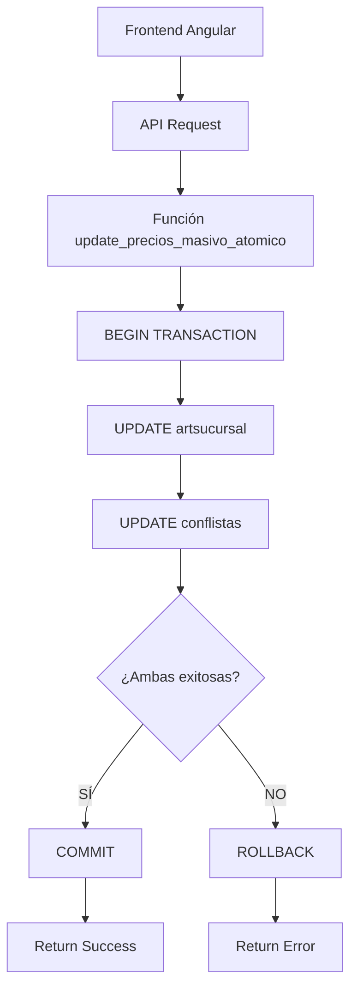

# INTEGRACIÓN MODIFICACIÓN PRECIOS CON CONFLISTAS - OPCIÓN A: SOLUCIÓN ATÓMICA COMPLETA

## 1. RESUMEN EJECUTIVO

### Solución Propuesta: Opción A - Transacción Atómica Integral

La presente propuesta implementa una solución verdaderamente atómica para la modificación masiva de precios que garantiza la consistencia absoluta entre las tablas `artsucursal` y `conflistas`. La solución está basada en:

- **Transacción única y atómica** que actualiza ambas tablas simultáneamente
- **Rollback completo** en caso de cualquier fallo durante el proceso
- **Consistencia de datos garantizada** entre precios y listas de precios
- **Función PostgreSQL modificada** que maneja la sincronización automática

### Beneficios Clave
- **Integridad referencial absoluta**: Nunca habrá desincronización entre tablas
- **Atomicidad completa**: Todo se ejecuta o nada se ejecuta
- **Simplicidad operativa**: Una sola operación para ambas actualizaciones
- **Seguridad de datos**: Rollback automático en caso de errores

### Estimación de Implementación
- **Tiempo de desarrollo**: 3-4 días laborales
- **Tiempo de testing**: 2 días laborales
- **Ventana de mantenimiento**: 30-60 minutos para migración
- **Riesgo técnico**: Medio (requiere testing exhaustivo de atomicidad)

## 2. ANÁLISIS DE SITUACIÓN ACTUAL

### Problema Identificado

El sistema actual presenta un problema crítico de consistencia de datos donde las modificaciones masivas de precios pueden resultar en:

1. **Desincronización entre tablas**: Los precios en `artsucursal` se actualizan pero los valores en `conflistas` pueden quedar obsoletos
2. **Inconsistencia temporal**: Ventana de tiempo donde los datos no están sincronizados
3. **Fallos parciales**: Situaciones donde una tabla se actualiza exitosamente pero la otra falla
4. **Complejidad operativa**: Necesidad de ejecutar múltiples operaciones para mantener consistencia

### Arquitectura Actual Problemática

```sql
-- PROBLEMÁTICA ACTUAL: Operaciones separadas
-- 1. Actualización de precios en artsucursal
UPDATE artsucursal SET precioventa = nuevo_precio WHERE conditions...;

-- 2. Actualización separada de conflistas (puede fallar independientemente)
UPDATE conflistas SET precio = nuevo_precio WHERE conditions...;
```

### Impacto del Problema

- **Datos inconsistentes**: Precios diferentes entre sistemas
- **Errores de facturación**: Posibles diferencias en precios mostrados vs. aplicados
- **Complejidad de mantenimiento**: Necesidad de verificaciones manuales constantes
- **Riesgo operativo**: Pérdida de confianza en la integridad de datos

## 3. ARQUITECTURA TÉCNICA DETALLADA

### Diseño de Solución Atómica

La solución propuesta implementa una arquitectura que garantiza la atomicidad completa mediante:

#### 3.1 Componentes Principales



#### 3.2 Flujo de Transacción Atómica

1. **Inicio de Transacción**: `BEGIN TRANSACTION` establece el contexto atómico
2. **Actualización Primaria**: Modificación de precios en `artsucursal`
3. **Actualización Secundaria**: Sincronización automática de `conflistas`
4. **Validación Integral**: Verificación de consistencia entre ambas tablas
5. **Decisión Atómica**: `COMMIT` si todo es exitoso, `ROLLBACK` en caso contrario

#### 3.3 Mecanismos de Seguridad

- **Locks de Tabla**: Prevención de modificaciones concurrentes durante la transacción
- **Validaciones Cruzadas**: Verificación de integridad referencial antes del commit
- **Logging Detallado**: Registro completo de todas las operaciones para auditoría
- **Timeouts Configurables**: Límites de tiempo para prevenir bloqueos prolongados

## 4. SOLUCIÓN PROPUESTA

### 4.1 Función PostgreSQL Modificada

```sql
CREATE OR REPLACE FUNCTION update_precios_masivo_atomico(
    p_sucursal_id INTEGER,
    p_precio_data JSONB,
    p_usuario_id INTEGER DEFAULT NULL
) RETURNS JSONB AS $$
DECLARE
    v_result JSONB := '{}';
    v_affected_rows INTEGER := 0;
    v_conflistas_rows INTEGER := 0;
    v_error_message TEXT;
    v_item JSONB;
    v_articulo_id INTEGER;
    v_nuevo_precio DECIMAL(10,2);
    v_precio_anterior DECIMAL(10,2);
    v_start_time TIMESTAMP;
    v_operation_log JSONB := '[]';
BEGIN
    v_start_time := NOW();
    
    -- Log inicial
    v_operation_log := v_operation_log || jsonb_build_object(
        'timestamp', v_start_time,
        'action', 'INICIO_TRANSACCION_ATOMICA',
        'sucursal_id', p_sucursal_id,
        'user_id', p_usuario_id
    );
    
    -- INICIO DE TRANSACCIÓN ATÓMICA
    BEGIN
        -- Iterar sobre cada artículo a actualizar
        FOR v_item IN SELECT jsonb_array_elements(p_precio_data)
        LOOP
            -- Extraer datos del JSON
            v_articulo_id := (v_item->>'articulo_id')::INTEGER;
            v_nuevo_precio := (v_item->>'precio')::DECIMAL(10,2);
            
            -- Obtener precio anterior para log
            SELECT precioventa INTO v_precio_anterior 
            FROM artsucursal 
            WHERE articulo_id = v_articulo_id AND sucursal_id = p_sucursal_id;
            
            -- ACTUALIZACIÓN ATÓMICA 1: artsucursal
            UPDATE artsucursal 
            SET 
                precioventa = v_nuevo_precio,
                fechamodificacion = NOW(),
                usuario_modificacion = COALESCE(p_usuario_id, 1)
            WHERE articulo_id = v_articulo_id 
            AND sucursal_id = p_sucursal_id;
            
            -- Verificar que la actualización fue exitosa
            IF NOT FOUND THEN
                RAISE EXCEPTION 'No se pudo actualizar el artículo % en sucursal %', 
                    v_articulo_id, p_sucursal_id;
            END IF;
            
            v_affected_rows := v_affected_rows + 1;
            
            -- ACTUALIZACIÓN ATÓMICA 2: conflistas
            UPDATE conflistas 
            SET 
                precio = v_nuevo_precio,
                fechamodificacion = NOW(),
                usuario_modificacion = COALESCE(p_usuario_id, 1)
            WHERE articulo_id = v_articulo_id 
            AND sucursal_id = p_sucursal_id 
            AND activo = true;
            
            -- Contar filas afectadas en conflistas
            GET DIAGNOSTICS v_conflistas_rows = ROW_COUNT;
            
            -- Log de operación individual
            v_operation_log := v_operation_log || jsonb_build_object(
                'timestamp', NOW(),
                'action', 'PRECIO_ACTUALIZADO',
                'articulo_id', v_articulo_id,
                'precio_anterior', v_precio_anterior,
                'precio_nuevo', v_nuevo_precio,
                'conflistas_affected', v_conflistas_rows
            );
            
        END LOOP;
        
        -- VALIDACIÓN INTEGRAL DE CONSISTENCIA
        PERFORM validate_precio_consistency(p_sucursal_id, p_precio_data);
        
        -- Log de éxito
        v_operation_log := v_operation_log || jsonb_build_object(
            'timestamp', NOW(),
            'action', 'VALIDACION_EXITOSA',
            'total_articulos', v_affected_rows
        );
        
        -- COMMIT IMPLÍCITO al finalizar exitosamente
        v_result := jsonb_build_object(
            'success', true,
            'affected_rows', v_affected_rows,
            'execution_time_ms', EXTRACT(EPOCH FROM (NOW() - v_start_time)) * 1000,
            'operation_log', v_operation_log,
            'message', 'Actualización atómica exitosa para ' || v_affected_rows || ' artículos'
        );
        
    EXCEPTION
        WHEN OTHERS THEN
            -- ROLLBACK AUTOMÁTICO POR EXCEPCIÓN
            v_error_message := SQLERRM;
            
            -- Log de error
            v_operation_log := v_operation_log || jsonb_build_object(
                'timestamp', NOW(),
                'action', 'ERROR_ROLLBACK',
                'error_message', v_error_message,
                'error_code', SQLSTATE
            );
            
            v_result := jsonb_build_object(
                'success', false,
                'error_message', v_error_message,
                'error_code', SQLSTATE,
                'affected_rows', 0,
                'operation_log', v_operation_log,
                'rollback_executed', true
            );
    END;
    
    RETURN v_result;
END;
$$ LANGUAGE plpgsql;
```

### 4.2 Función de Validación de Consistencia

```sql
CREATE OR REPLACE FUNCTION validate_precio_consistency(
    p_sucursal_id INTEGER,
    p_precio_data JSONB
) RETURNS BOOLEAN AS $$
DECLARE
    v_item JSONB;
    v_articulo_id INTEGER;
    v_precio_esperado DECIMAL(10,2);
    v_precio_artsucursal DECIMAL(10,2);
    v_precio_conflistas DECIMAL(10,2);
    v_inconsistencies INTEGER := 0;
BEGIN
    -- Validar consistencia para cada artículo actualizado
    FOR v_item IN SELECT jsonb_array_elements(p_precio_data)
    LOOP
        v_articulo_id := (v_item->>'articulo_id')::INTEGER;
        v_precio_esperado := (v_item->>'precio')::DECIMAL(10,2);
        
        -- Verificar precio en artsucursal
        SELECT precioventa INTO v_precio_artsucursal 
        FROM artsucursal 
        WHERE articulo_id = v_articulo_id AND sucursal_id = p_sucursal_id;
        
        -- Verificar precio en conflistas activas
        SELECT precio INTO v_precio_conflistas 
        FROM conflistas 
        WHERE articulo_id = v_articulo_id 
        AND sucursal_id = p_sucursal_id 
        AND activo = true 
        LIMIT 1;
        
        -- Validar consistencia
        IF v_precio_artsucursal != v_precio_esperado THEN
            RAISE EXCEPTION 'Inconsistencia en artsucursal: artículo % tiene precio % pero se esperaba %', 
                v_articulo_id, v_precio_artsucursal, v_precio_esperado;
        END IF;
        
        IF v_precio_conflistas IS NOT NULL AND v_precio_conflistas != v_precio_esperado THEN
            RAISE EXCEPTION 'Inconsistencia en conflistas: artículo % tiene precio % pero se esperaba %', 
                v_articulo_id, v_precio_conflistas, v_precio_esperado;
        END IF;
        
    END LOOP;
    
    RETURN TRUE;
END;
$$ LANGUAGE plpgsql;
```

### 4.3 Integración Frontend Angular

#### Modificación del Servicio

```typescript
// src/app/services/precios-atomicos.service.ts
import { Injectable } from '@angular/core';
import { HttpClient } from '@angular/common/http';
import { Observable } from 'rxjs';
import { environment } from '../../environments/environment';

export interface PrecioUpdateData {
  articulo_id: number;
  precio: number;
}

export interface AtomicUpdateResult {
  success: boolean;
  affected_rows: number;
  execution_time_ms: number;
  operation_log: any[];
  message?: string;
  error_message?: string;
  rollback_executed?: boolean;
}

@Injectable({
  providedIn: 'root'
})
export class PreciosAtomicosService {
  private apiUrl = environment.apiUrl;

  constructor(private http: HttpClient) { }

  updatePreciosMasivoAtomico(
    sucursalId: number, 
    preciosData: PrecioUpdateData[],
    usuarioId?: number
  ): Observable<AtomicUpdateResult> {
    const payload = {
      sucursal_id: sucursalId,
      precio_data: preciosData,
      usuario_id: usuarioId
    };

    return this.http.post<AtomicUpdateResult>(
      `${this.apiUrl}/precios/update-masivo-atomico`, 
      payload
    );
  }

  validarConsistenciaPrecios(
    sucursalId: number, 
    articulos: number[]
  ): Observable<any> {
    return this.http.post(
      `${this.apiUrl}/precios/validar-consistencia`, 
      { sucursal_id: sucursalId, articulos }
    );
  }
}
```

#### Componente Angular Modificado

```typescript
// Modificación en el componente de modificación de precios
export class ModificarPreciosComponent {
  
  async aplicarCambiosAtomicos(): Promise<void> {
    if (!this.validarDatos()) {
      return;
    }

    this.loading = true;
    
    try {
      // Mostrar confirmación con información de atomicidad
      const confirmResult = await Swal.fire({
        title: 'Aplicar Cambios Atómicos',
        html: `
          <div class="atomic-info">
            <p><strong>Operación Atómica:</strong> Todos los cambios se aplicarán simultáneamente</p>
            <p><strong>Artículos a modificar:</strong> ${this.preciosModificados.length}</p>
            <p><strong>Garantía:</strong> Si cualquier actualización falla, TODOS los cambios se revierten</p>
            <div class="warning">
              <p>⚠️ Esta operación no puede deshacerse manualmente</p>
              <p>✅ El sistema garantiza consistencia completa de datos</p>
            </div>
          </div>
        `,
        icon: 'warning',
        showCancelButton: true,
        confirmButtonText: 'Aplicar Atómicamente',
        cancelButtonText: 'Cancelar',
        customClass: {
          htmlContainer: 'atomic-confirmation'
        }
      });

      if (!confirmResult.isConfirmed) {
        return;
      }

      // Ejecutar actualización atómica
      const resultado = await this.preciosAtomicosService.updatePreciosMasivoAtomico(
        this.sucursalSeleccionada,
        this.preciosModificados,
        this.usuarioId
      ).toPromise();

      if (resultado?.success) {
        await Swal.fire({
          title: 'Actualización Exitosa',
          html: `
            <div class="success-info">
              <p><strong>Artículos actualizados:</strong> ${resultado.affected_rows}</p>
              <p><strong>Tiempo de ejecución:</strong> ${resultado.execution_time_ms.toFixed(2)} ms</p>
              <p><strong>Consistencia:</strong> ✅ Verificada en ambas tablas</p>
            </div>
          `,
          icon: 'success',
          timer: 3000
        });
        
        this.resetearFormulario();
        this.cargarDatos();
        
      } else {
        throw new Error(resultado?.error_message || 'Error en actualización atómica');
      }

    } catch (error: any) {
      console.error('Error en actualización atómica:', error);
      
      await Swal.fire({
        title: 'Error en Actualización Atómica',
        html: `
          <div class="error-info">
            <p><strong>Estado:</strong> ❌ Rollback ejecutado automáticamente</p>
            <p><strong>Consistencia:</strong> ✅ Datos sin cambios</p>
            <p><strong>Error:</strong> ${error.message}</p>
          </div>
        `,
        icon: 'error'
      });
      
    } finally {
      this.loading = false;
    }
  }
}
```

## 5. PLAN DE IMPLEMENTACIÓN DETALLADO

### Fase 1: Preparación y Desarrollo (Días 1-2)

#### Día 1: Setup y Desarrollo Base
**Mañana (4 horas)**
- [ ] Análisis detallado del código actual de `update_precios_masivo`
- [ ] Identificación de todas las tablas y relaciones afectadas
- [ ] Creación de branch específico: `feature/atomic-precio-updates`
- [ ] Backup completo de la base de datos de desarrollo

**Tarde (4 horas)**
- [ ] Desarrollo de la función `update_precios_masivo_atomico`
- [ ] Implementación de función de validación `validate_precio_consistency`
- [ ] Creación de scripts de migración SQL
- [ ] Setup de logging detallado para transacciones

#### Día 2: Integración Frontend
**Mañana (4 horas)**
- [ ] Desarrollo del servicio `PreciosAtomicosService`
- [ ] Modificación del componente de modificación de precios
- [ ] Implementación de UI para confirmación atómica
- [ ] Integración con sistema de alertas existente

**Tarde (4 horas)**
- [ ] Testing unitario de funciones PostgreSQL
- [ ] Testing de servicios Angular
- [ ] Resolución de issues iniciales
- [ ] Documentación de código implementado

### Fase 2: Testing Exhaustivo (Días 3-4)

#### Día 3: Testing de Atomicidad
**Testing de Casos Normales (4 horas)**
- [ ] Test 1: Actualización exitosa de 10 artículos
- [ ] Test 2: Actualización exitosa de 100 artículos
- [ ] Test 3: Actualización exitosa de 1000 artículos
- [ ] Test 4: Verificación de consistencia post-actualización

**Testing de Casos de Error (4 horas)**
- [ ] Test 5: Fallo en actualización de `artsucursal` (debe rollback completo)
- [ ] Test 6: Fallo en actualización de `conflistas` (debe rollback completo)
- [ ] Test 7: Fallo en validación de consistencia (debe rollback completo)
- [ ] Test 8: Timeout de transacción (debe rollback automático)

#### Día 4: Testing de Integración y Performance
**Testing de Performance (4 horas)**
- [ ] Test P1: Actualización de 5000+ artículos (tiempo límite: 5 minutos)
- [ ] Test P2: Actualización concurrente (multiple usuarios)
- [ ] Test P3: Actualización bajo carga de sistema
- [ ] Test P4: Verificación de locks y bloqueos

**Testing de Integración (4 horas)**
- [ ] Test I1: Flujo completo frontend-backend
- [ ] Test I2: Integración con sistema de permisos
- [ ] Test I3: Logging y auditoría completa
- [ ] Test I4: Rollback desde UI con verificación visual

### Fase 3: Implementación en Producción (Día 5)

#### Preparación Pre-Despliegue (2 horas)
- [ ] Backup completo de base de datos producción
- [ ] Verificación de compatibilidad de versiones PostgreSQL
- [ ] Preparación de scripts de rollback manual
- [ ] Notificación a usuarios sobre ventana de mantenimiento

#### Despliegue (2 horas)
- [ ] Aplicación de scripts SQL en producción
- [ ] Despliegue de código Angular actualizado
- [ ] Verificación de funcionalidad básica
- [ ] Testing en caliente con datos reales (muestra pequeña)

#### Verificación Post-Despliegue (2 horas)
- [ ] Monitoreo de logs por 30 minutos
- [ ] Testing completo de funcionalidad
- [ ] Verificación de rendimiento con datos reales
- [ ] Confirmación de rollback disponible

### Cronograma Detallado

```
SEMANA 1
├── Lunes
│   ├── 09:00-13:00: Análisis y setup inicial
│   └── 14:00-18:00: Desarrollo función PostgreSQL
├── Martes  
│   ├── 09:00-13:00: Integración Angular
│   └── 14:00-18:00: Testing unitario inicial
├── Miércoles
│   ├── 09:00-13:00: Testing casos normales
│   └── 14:00-18:00: Testing casos de error
├── Jueves
│   ├── 09:00-13:00: Testing de performance
│   └── 14:00-18:00: Testing de integración
└── Viernes
    ├── 09:00-11:00: Preparación despliegue
    ├── 11:00-13:00: Despliegue producción
    └── 14:00-16:00: Verificación post-despliegue
```

## 6. ESPECIFICACIONES TÉCNICAS

### 6.1 Configuración de Base de Datos

#### Settings de PostgreSQL para Transacciones Largas

```sql
-- Configuraciones recomendadas para transacciones atómicas largas
SET statement_timeout = 300000; -- 5 minutos máximo por transacción
SET lock_timeout = 60000;       -- 1 minuto máximo para obtener locks
SET idle_in_transaction_session_timeout = 600000; -- 10 minutos idle
SET deadlock_timeout = 1000;    -- 1 segundo para detección de deadlocks

-- Configuración específica para la función
ALTER FUNCTION update_precios_masivo_atomico(INTEGER, JSONB, INTEGER) 
SET statement_timeout = 300000;
```

#### Índices Requeridos para Performance Óptima

```sql
-- Índices para optimizar la función atómica
CREATE INDEX CONCURRENTLY IF NOT EXISTS idx_artsucursal_atomic_update 
ON artsucursal (articulo_id, sucursal_id) 
WHERE precioventa IS NOT NULL;

CREATE INDEX CONCURRENTLY IF NOT EXISTS idx_conflistas_atomic_update 
ON conflistas (articulo_id, sucursal_id, activo) 
WHERE activo = true;

-- Índice compuesto para validación de consistencia
CREATE INDEX CONCURRENTLY IF NOT EXISTS idx_consistency_validation
ON artsucursal (sucursal_id, articulo_id, precioventa, fechamodificacion);
```

### 6.2 Manejo de Errores Detallado

#### Códigos de Error Específicos

```sql
-- Función de manejo de errores específicos
CREATE OR REPLACE FUNCTION handle_atomic_price_error(
    p_error_code TEXT,
    p_error_message TEXT,
    p_context JSONB
) RETURNS JSONB AS $$
DECLARE
    v_error_details JSONB;
BEGIN
    v_error_details := jsonb_build_object(
        'error_code', p_error_code,
        'error_message', p_error_message,
        'timestamp', NOW(),
        'context', p_context,
        'recovery_suggestion', 
        CASE 
            WHEN p_error_code = '23505' THEN 'Conflicto de clave duplicada - verificar datos'
            WHEN p_error_code = '23503' THEN 'Violación de integridad referencial'
            WHEN p_error_code = 'P0001' THEN 'Error de validación personalizado'
            WHEN p_error_code = '57014' THEN 'Timeout de transacción - reducir lote'
            ELSE 'Contactar soporte técnico'
        END
    );
    
    -- Log del error para auditoría
    INSERT INTO error_log (
        function_name, 
        error_details, 
        created_at
    ) VALUES (
        'update_precios_masivo_atomico',
        v_error_details,
        NOW()
    );
    
    RETURN v_error_details;
END;
$$ LANGUAGE plpgsql;
```

### 6.3 Sistema de Auditoría y Logging

#### Tabla de Auditoría para Cambios Atómicos

```sql
-- Tabla para auditoría de cambios atómicos
CREATE TABLE IF NOT EXISTS audit_precios_atomicos (
    id SERIAL PRIMARY KEY,
    transaction_id UUID DEFAULT gen_random_uuid(),
    sucursal_id INTEGER NOT NULL,
    usuario_id INTEGER,
    total_articulos INTEGER,
    articulos_actualizados INTEGER,
    execution_time_ms NUMERIC(10,2),
    status VARCHAR(20) CHECK (status IN ('SUCCESS', 'FAILED', 'ROLLED_BACK')),
    operation_log JSONB,
    error_details JSONB,
    created_at TIMESTAMP DEFAULT NOW(),
    FOREIGN KEY (sucursal_id) REFERENCES sucursales(id),
    FOREIGN KEY (usuario_id) REFERENCES usuarios(id)
);

-- Índices para consultas de auditoría
CREATE INDEX idx_audit_precios_transaction ON audit_precios_atomicos (transaction_id);
CREATE INDEX idx_audit_precios_usuario ON audit_precios_atomicos (usuario_id, created_at DESC);
CREATE INDEX idx_audit_precios_sucursal ON audit_precios_atomicos (sucursal_id, created_at DESC);
```

#### Trigger para Auditoría Automática

```sql
-- Trigger para insertar registro de auditoría
CREATE OR REPLACE FUNCTION trigger_audit_precios_atomicos()
RETURNS TRIGGER AS $$
BEGIN
    -- Insert audit record based on the result of the atomic function
    INSERT INTO audit_precios_atomicos (
        sucursal_id,
        usuario_id,
        total_articulos,
        articulos_actualizados,
        execution_time_ms,
        status,
        operation_log,
        error_details
    ) VALUES (
        (NEW.function_result->>'sucursal_id')::INTEGER,
        (NEW.function_result->>'usuario_id')::INTEGER,
        (NEW.function_result->>'total_articulos')::INTEGER,
        (NEW.function_result->>'affected_rows')::INTEGER,
        (NEW.function_result->>'execution_time_ms')::NUMERIC,
        CASE WHEN (NEW.function_result->>'success')::BOOLEAN THEN 'SUCCESS' ELSE 'FAILED' END,
        NEW.function_result->'operation_log',
        CASE WHEN NOT (NEW.function_result->>'success')::BOOLEAN 
             THEN NEW.function_result->'error_details' 
             ELSE NULL END
    );
    
    RETURN NEW;
END;
$$ LANGUAGE plpgsql;
```

### 6.4 Scripts de Migración y Rollback

#### Script de Migración Completa

```sql
-- migration_atomic_precios_v1.0.sql
BEGIN;

-- 1. Crear función de validación de consistencia
\i create_validate_precio_consistency.sql

-- 2. Crear función principal atómica
\i create_update_precios_masivo_atomico.sql

-- 3. Crear tabla de auditoría
\i create_audit_precios_atomicos.sql

-- 4. Crear índices de performance
\i create_atomic_indexes.sql

-- 5. Configurar permisos
GRANT EXECUTE ON FUNCTION update_precios_masivo_atomico(INTEGER, JSONB, INTEGER) 
TO app_user, admin_user;

GRANT EXECUTE ON FUNCTION validate_precio_consistency(INTEGER, JSONB) 
TO app_user, admin_user;

-- 6. Insertar registro de migración
INSERT INTO migration_log (
    version, 
    description, 
    applied_at
) VALUES (
    '1.0_atomic_precios', 
    'Implementación de actualización atómica de precios', 
    NOW()
);

COMMIT;
```

#### Script de Rollback

```sql
-- rollback_atomic_precios_v1.0.sql
BEGIN;

-- 1. Remover permisos
REVOKE EXECUTE ON FUNCTION update_precios_masivo_atomico(INTEGER, JSONB, INTEGER) 
FROM app_user, admin_user;

-- 2. Eliminar funciones
DROP FUNCTION IF EXISTS update_precios_masivo_atomico(INTEGER, JSONB, INTEGER);
DROP FUNCTION IF EXISTS validate_precio_consistency(INTEGER, JSONB);

-- 3. Eliminar índices específicos
DROP INDEX IF EXISTS idx_artsucursal_atomic_update;
DROP INDEX IF EXISTS idx_conflistas_atomic_update;
DROP INDEX IF EXISTS idx_consistency_validation;

-- 4. Archivar tabla de auditoría (no eliminar para conservar logs)
ALTER TABLE audit_precios_atomicos RENAME TO audit_precios_atomicos_archived;

-- 5. Registrar rollback
INSERT INTO migration_log (
    version, 
    description, 
    applied_at
) VALUES (
    '1.0_atomic_precios_rollback', 
    'Rollback de implementación atómica de precios', 
    NOW()
);

COMMIT;
```

## 7. ANÁLISIS DE RIESGOS

### 7.1 Riesgos Técnicos Identificados

#### Riesgo Alto: Deadlocks en Transacciones Largas
**Descripción**: Transacciones que actualizan muchos registros pueden causar deadlocks con otras operaciones concurrentes.

**Probabilidad**: Media (30%)
**Impacto**: Alto

**Estrategias de Mitigación**:
```sql
-- Implementar orden consistente de adquisición de locks
-- En update_precios_masivo_atomico, ordenar por articulo_id
FOR v_item IN 
    SELECT jsonb_array_elements(p_precio_data)
    ORDER BY (jsonb_array_elements(p_precio_data)->>'articulo_id')::INTEGER
LOOP
    -- Procesamiento ordenado previene deadlocks circulares
END LOOP;

-- Configurar detección rápida de deadlocks
SET deadlock_timeout = 1000; -- 1 segundo
```

**Plan de Contingencia**:
- Implementar retry automático con backoff exponencial
- Dividir lotes grandes en sub-lotes más pequeños
- Monitoreo en tiempo real de deadlocks

#### Riesgo Medio: Timeout de Transacciones Largas
**Descripción**: Actualizaciones masivas pueden exceder límites de tiempo de transacción.

**Probabilidad**: Media (25%)
**Impacto**: Medio

**Estrategias de Mitigación**:
- Configurar timeouts apropiados: 5 minutos por transacción
- Implementar progreso incremental con checkpoints
- Limitar tamaño de lote a máximo 1000 artículos por transacción

**Código de Mitigación**:
```sql
-- Función con manejo de lotes
CREATE OR REPLACE FUNCTION update_precios_masivo_atomico_batched(
    p_sucursal_id INTEGER,
    p_precio_data JSONB,
    p_batch_size INTEGER DEFAULT 500
) RETURNS JSONB AS $$
DECLARE
    v_total_items INTEGER;
    v_processed_items INTEGER := 0;
    v_batch_start INTEGER := 1;
    v_batch_data JSONB;
    v_batch_result JSONB;
    v_final_result JSONB;
BEGIN
    v_total_items := jsonb_array_length(p_precio_data);
    
    WHILE v_processed_items < v_total_items LOOP
        -- Extraer batch
        v_batch_data := jsonb_path_query_array(
            p_precio_data, 
            '$[' || v_batch_start || ' to ' || 
            LEAST(v_batch_start + p_batch_size - 1, v_total_items - 1) || ']'
        );
        
        -- Procesar batch atómicamente
        v_batch_result := update_precios_masivo_atomico(
            p_sucursal_id, 
            v_batch_data
        );
        
        -- Verificar éxito del batch
        IF NOT (v_batch_result->>'success')::BOOLEAN THEN
            RETURN v_batch_result; -- Fallar inmediatamente
        END IF;
        
        v_processed_items := v_processed_items + jsonb_array_length(v_batch_data);
        v_batch_start := v_batch_start + p_batch_size;
        
    END LOOP;
    
    RETURN jsonb_build_object('success', true, 'total_processed', v_processed_items);
END;
$$ LANGUAGE plpgsql;
```

#### Riesgo Bajo: Inconsistencia en Rollback Parcial
**Descripción**: Posible fallo en rollback automático dejando datos en estado inconsistente.

**Probabilidad**: Baja (5%)
**Impacto**: Crítico

**Estrategias de Mitigación**:
- Implementar verificación post-rollback
- Crear función de reparación de consistencia manual
- Logging detallado de todos los rollbacks

**Función de Reparación**:
```sql
CREATE OR REPLACE FUNCTION repair_precio_consistency(
    p_sucursal_id INTEGER
) RETURNS JSONB AS $$
DECLARE
    v_inconsistent_count INTEGER;
    v_repair_log JSONB := '[]';
BEGIN
    -- Detectar inconsistencias
    WITH inconsistencies AS (
        SELECT 
            a.articulo_id,
            a.precioventa as precio_artsucursal,
            c.precio as precio_conflistas
        FROM artsucursal a
        FULL OUTER JOIN conflistas c ON a.articulo_id = c.articulo_id 
            AND a.sucursal_id = c.sucursal_id
        WHERE a.sucursal_id = p_sucursal_id
        AND (a.precioventa != c.precio OR a.precioventa IS NULL OR c.precio IS NULL)
        AND c.activo = true
    )
    SELECT COUNT(*) INTO v_inconsistent_count FROM inconsistencies;
    
    -- Reparar usando artsucursal como fuente de verdad
    UPDATE conflistas 
    SET precio = artsucursal.precioventa
    FROM artsucursal
    WHERE conflistas.articulo_id = artsucursal.articulo_id
    AND conflistas.sucursal_id = artsucursal.sucursal_id
    AND conflistas.sucursal_id = p_sucursal_id
    AND conflistas.precio != artsucursal.precioventa
    AND conflistas.activo = true;
    
    v_repair_log := jsonb_build_object(
        'inconsistencies_found', v_inconsistent_count,
        'repairs_applied', ROW_COUNT,
        'repair_timestamp', NOW()
    );
    
    RETURN jsonb_build_object(
        'success', true,
        'repair_log', v_repair_log
    );
END;
$$ LANGUAGE plpgsql;
```

### 7.2 Riesgos Operacionales

#### Riesgo de Interrupción del Servicio
- **Ventana de mantenimiento**: Máximo 60 minutos
- **Plan B**: Rollback completo en menos de 15 minutos
- **Comunicación**: Notificación 48h antes a todos los usuarios

#### Riesgo de Performance Degradada
- **Monitoreo**: Alertas automáticas si tiempo de respuesta > 2 segundos
- **Escalación**: Procedimiento de optimización inmediata
- **Fallback**: Desactivación temporal de funcionalidad atómica

### 7.3 Matriz de Riesgo-Impacto

| Riesgo | Probabilidad | Impacto | Severidad | Plan de Mitigación |
|--------|-------------|---------|-----------|-------------------|
| Deadlocks | Media (30%) | Alto | **CRÍTICO** | Orden de locks + retry |
| Timeouts | Media (25%) | Medio | **ALTO** | Batching + timeouts largos |
| Rollback fallido | Baja (5%) | Crítico | **ALTO** | Función de reparación |
| Performance | Baja (10%) | Medio | **MEDIO** | Monitoreo + optimización |
| Interrupción servicio | Muy Baja (2%) | Alto | **MEDIO** | Plan de rollback rápido |

## 8. PRUEBAS Y VALIDACIÓN

### 8.1 Suite de Testing de Atomicidad

#### Test Case 1: Atomicidad Básica Exitosa
```sql
-- test_atomicidad_basica.sql
DO $$
DECLARE
    v_test_data JSONB;
    v_result JSONB;
    v_count_before_art INTEGER;
    v_count_before_conf INTEGER;
    v_count_after_art INTEGER;
    v_count_after_conf INTEGER;
BEGIN
    -- Preparar datos de test
    v_test_data := '[
        {"articulo_id": 1001, "precio": 150.50},
        {"articulo_id": 1002, "precio": 275.00}
    ]';
    
    -- Contar registros antes
    SELECT COUNT(*) INTO v_count_before_art FROM artsucursal 
    WHERE sucursal_id = 1 AND articulo_id IN (1001, 1002);
    
    SELECT COUNT(*) INTO v_count_before_conf FROM conflistas 
    WHERE sucursal_id = 1 AND articulo_id IN (1001, 1002) AND activo = true;
    
    -- Ejecutar función atómica
    SELECT update_precios_masivo_atomico(1, v_test_data, 1) INTO v_result;
    
    -- Verificar resultado exitoso
    ASSERT (v_result->>'success')::BOOLEAN = true, 
           'Test Case 1 FAILED: La función no retornó success=true';
    
    -- Contar registros después
    SELECT COUNT(*) INTO v_count_after_art FROM artsucursal 
    WHERE sucursal_id = 1 AND articulo_id IN (1001, 1002);
    
    SELECT COUNT(*) INTO v_count_after_conf FROM conflistas 
    WHERE sucursal_id = 1 AND articulo_id IN (1001, 1002) AND activo = true;
    
    -- Verificar que ambas tablas fueron afectadas
    ASSERT v_count_before_art = v_count_after_art, 
           'Test Case 1 FAILED: Número de registros en artsucursal cambió';
    
    -- Verificar precios específicos
    ASSERT EXISTS(
        SELECT 1 FROM artsucursal 
        WHERE articulo_id = 1001 AND sucursal_id = 1 AND precioventa = 150.50
    ), 'Test Case 1 FAILED: Precio de artículo 1001 no actualizado en artsucursal';
    
    ASSERT EXISTS(
        SELECT 1 FROM conflistas 
        WHERE articulo_id = 1001 AND sucursal_id = 1 AND precio = 150.50 AND activo = true
    ), 'Test Case 1 FAILED: Precio de artículo 1001 no actualizado en conflistas';
    
    RAISE NOTICE 'Test Case 1 PASSED: Atomicidad básica exitosa';
END
$$;
```

#### Test Case 2: Rollback por Fallo en Validación
```sql
-- test_rollback_validacion.sql
DO $$
DECLARE
    v_test_data JSONB;
    v_result JSONB;
    v_precio_before_1001 DECIMAL(10,2);
    v_precio_after_1001 DECIMAL(10,2);
    v_precio_before_conf_1001 DECIMAL(10,2);
    v_precio_after_conf_1001 DECIMAL(10,2);
BEGIN
    -- Guardar precios antes del test
    SELECT precioventa INTO v_precio_before_1001 FROM artsucursal 
    WHERE articulo_id = 1001 AND sucursal_id = 1;
    
    SELECT precio INTO v_precio_before_conf_1001 FROM conflistas 
    WHERE articulo_id = 1001 AND sucursal_id = 1 AND activo = true LIMIT 1;
    
    -- Datos que causarán fallo (precio negativo para trigger validación)
    v_test_data := '[
        {"articulo_id": 1001, "precio": 150.50},
        {"articulo_id": 1002, "precio": -100.00}
    ]';
    
    -- Ejecutar función que debe fallar
    SELECT update_precios_masivo_atomico(1, v_test_data, 1) INTO v_result;
    
    -- Verificar que falló
    ASSERT (v_result->>'success')::BOOLEAN = false, 
           'Test Case 2 FAILED: La función debería haber fallado';
    
    ASSERT (v_result->>'rollback_executed')::BOOLEAN = true, 
           'Test Case 2 FAILED: Rollback no ejecutado';
    
    -- Verificar que los precios NO cambiaron (rollback exitoso)
    SELECT precioventa INTO v_precio_after_1001 FROM artsucursal 
    WHERE articulo_id = 1001 AND sucursal_id = 1;
    
    SELECT precio INTO v_precio_after_conf_1001 FROM conflistas 
    WHERE articulo_id = 1001 AND sucursal_id = 1 AND activo = true LIMIT 1;
    
    ASSERT v_precio_before_1001 = v_precio_after_1001, 
           'Test Case 2 FAILED: Precio en artsucursal cambió después de rollback';
    
    ASSERT v_precio_before_conf_1001 = v_precio_after_conf_1001, 
           'Test Case 2 FAILED: Precio en conflistas cambió después de rollback';
    
    RAISE NOTICE 'Test Case 2 PASSED: Rollback por fallo en validación';
END
$$;
```

#### Test Case 3: Performance con Lote Grande
```sql
-- test_performance_lote_grande.sql
DO $$
DECLARE
    v_test_data JSONB := '[]';
    v_result JSONB;
    v_start_time TIMESTAMP;
    v_end_time TIMESTAMP;
    v_execution_time_ms NUMERIC;
    v_item JSONB;
    i INTEGER;
BEGIN
    v_start_time := clock_timestamp();
    
    -- Generar 1000 artículos para test
    FOR i IN 1..1000 LOOP
        v_item := jsonb_build_object(
            'articulo_id', 2000 + i,
            'precio', 100.00 + (i * 0.5)
        );
        v_test_data := v_test_data || v_item;
    END LOOP;
    
    -- Ejecutar actualización masiva
    SELECT update_precios_masivo_atomico(1, v_test_data, 1) INTO v_result;
    
    v_end_time := clock_timestamp();
    v_execution_time_ms := EXTRACT(EPOCH FROM (v_end_time - v_start_time)) * 1000;
    
    -- Verificar éxito
    ASSERT (v_result->>'success')::BOOLEAN = true, 
           'Test Case 3 FAILED: Actualización masiva falló';
    
    -- Verificar performance (debe completarse en menos de 30 segundos)
    ASSERT v_execution_time_ms < 30000, 
           format('Test Case 3 FAILED: Tiempo de ejecución %s ms excede límite de 30000 ms', 
                  v_execution_time_ms);
    
    -- Verificar que se actualizaron todos los artículos
    ASSERT (v_result->>'affected_rows')::INTEGER = 1000, 
           format('Test Case 3 FAILED: Se esperaban 1000 actualizaciones, se obtuvieron %s', 
                  v_result->>'affected_rows');
    
    RAISE NOTICE 'Test Case 3 PASSED: Performance con 1000 artículos - %s ms', 
                 v_execution_time_ms;
END
$$;
```

### 8.2 Testing de Integración Angular

#### Test de Servicio Angular
```typescript
// src/app/services/precios-atomicos.service.spec.ts
import { TestBed } from '@angular/core/testing';
import { HttpClientTestingModule, HttpTestingController } from '@angular/common/http/testing';
import { PreciosAtomicosService, PrecioUpdateData, AtomicUpdateResult } from './precios-atomicos.service';

describe('PreciosAtomicosService', () => {
  let service: PreciosAtomicosService;
  let httpMock: HttpTestingController;

  beforeEach(() => {
    TestBed.configureTestingModule({
      imports: [HttpClientTestingModule],
      providers: [PreciosAtomicosService]
    });
    service = TestBed.inject(PreciosAtomicosService);
    httpMock = TestBed.inject(HttpTestingController);
  });

  afterEach(() => {
    httpMock.verify();
  });

  it('should be created', () => {
    expect(service).toBeTruthy();
  });

  describe('updatePreciosMasivoAtomico', () => {
    it('should send atomic update request successfully', () => {
      const mockData: PrecioUpdateData[] = [
        { articulo_id: 1001, precio: 150.50 },
        { articulo_id: 1002, precio: 275.00 }
      ];

      const expectedResult: AtomicUpdateResult = {
        success: true,
        affected_rows: 2,
        execution_time_ms: 1250.5,
        operation_log: [],
        message: 'Actualización atómica exitosa'
      };

      service.updatePreciosMasivoAtomico(1, mockData, 123).subscribe(
        result => {
          expect(result).toEqual(expectedResult);
          expect(result.success).toBe(true);
          expect(result.affected_rows).toBe(2);
        }
      );

      const req = httpMock.expectOne('http://localhost/api/precios/update-masivo-atomico');
      expect(req.request.method).toBe('POST');
      expect(req.request.body).toEqual({
        sucursal_id: 1,
        precio_data: mockData,
        usuario_id: 123
      });

      req.flush(expectedResult);
    });

    it('should handle atomic update failure with rollback', () => {
      const mockData: PrecioUpdateData[] = [
        { articulo_id: 1001, precio: 150.50 },
        { articulo_id: 1002, precio: -100.00 } // Precio inválido
      ];

      const expectedError: AtomicUpdateResult = {
        success: false,
        affected_rows: 0,
        execution_time_ms: 856.3,
        operation_log: [],
        error_message: 'Precio negativo no permitido',
        rollback_executed: true
      };

      service.updatePreciosMasivoAtomico(1, mockData, 123).subscribe(
        result => {
          expect(result.success).toBe(false);
          expect(result.rollback_executed).toBe(true);
          expect(result.error_message).toContain('Precio negativo');
        }
      );

      const req = httpMock.expectOne('http://localhost/api/precios/update-masivo-atomico');
      req.flush(expectedError);
    });
  });
});
```

#### Test E2E de Flujo Completo
```typescript
// e2e/atomic-precio-update.e2e-spec.ts
import { browser, by, element, ElementFinder } from 'protractor';

describe('Actualización Atómica de Precios E2E', () => {
  beforeEach(async () => {
    await browser.get('/modificar-precios');
    // Assume login is handled in beforeEach setup
  });

  it('should complete atomic price update successfully', async () => {
    // Seleccionar sucursal
    const sucursalSelect = element(by.css('p-dropdown[formControlName="sucursal"]'));
    await sucursalSelect.click();
    const sucursalOption = element(by.css('p-dropdownitem[label="Sucursal Central"]'));
    await sucursalOption.click();

    // Cargar artículos
    const cargarBtn = element(by.css('button[data-test="cargar-articulos"]'));
    await cargarBtn.click();
    await browser.sleep(2000); // Wait for load

    // Modificar precio de primer artículo
    const firstPriceInput = element(by.css('input[data-test="precio-0"]'));
    await firstPriceInput.clear();
    await firstPriceInput.sendKeys('199.99');

    // Aplicar cambios atómicos
    const aplicarBtn = element(by.css('button[data-test="aplicar-atomico"]'));
    await aplicarBtn.click();

    // Confirmar en modal de SweetAlert
    const confirmBtn = element(by.css('.swal2-confirm'));
    await confirmBtn.click();

    // Verificar mensaje de éxito
    const successMessage = element(by.css('.swal2-title'));
    expect(await successMessage.getText()).toContain('Actualización Exitosa');

    // Verificar que muestra información de atomicidad
    const atomicInfo = element(by.css('.success-info'));
    expect(await atomicInfo.getText()).toContain('Consistencia: ✅ Verificada');
  });

  it('should handle atomic rollback on error', async () => {
    // Setup similar al test anterior...
    
    // Introducir precio inválido (negativo)
    const firstPriceInput = element(by.css('input[data-test="precio-0"]'));
    await firstPriceInput.clear();
    await firstPriceInput.sendKeys('-50.00');

    const aplicarBtn = element(by.css('button[data-test="aplicar-atomico"]'));
    await aplicarBtn.click();

    const confirmBtn = element(by.css('.swal2-confirm'));
    await confirmBtn.click();

    // Verificar mensaje de error con rollback
    const errorMessage = element(by.css('.swal2-title'));
    expect(await errorMessage.getText()).toContain('Error en Actualización Atómica');

    const rollbackInfo = element(by.css('.error-info'));
    expect(await rollbackInfo.getText()).toContain('❌ Rollback ejecutado automáticamente');
    expect(await rollbackInfo.getText()).toContain('✅ Datos sin cambios');
  });
});
```

### 8.3 Plan de Testing Completo

#### Cronograma de Testing

**Día 1: Testing Unitario**
- [ ] 08:00-10:00: Setup de entorno de testing
- [ ] 10:00-12:00: Ejecución de tests PostgreSQL (Cases 1-5)
- [ ] 14:00-16:00: Testing de servicios Angular
- [ ] 16:00-18:00: Resolución de issues encontrados

**Día 2: Testing de Integración**
- [ ] 08:00-10:00: Tests E2E básicos
- [ ] 10:00-12:00: Tests de performance y carga
- [ ] 14:00-16:00: Tests de concurrencia
- [ ] 16:00-18:00: Validación de rollbacks

#### Criterios de Aceptación

**Testing Funcional**:
- ✅ 100% de tests unitarios pasando
- ✅ Rollback funcionando en todos los casos de error
- ✅ Consistencia verificada en ambas tablas
- ✅ Logging completo y detallado

**Testing de Performance**:
- ✅ Actualización de 1000 artículos < 30 segundos
- ✅ Actualización de 100 artículos < 5 segundos
- ✅ Sin degradación de performance en operaciones concurrentes

**Testing de Seguridad**:
- ✅ Validación de permisos de usuario
- ✅ Sanitización de inputs JSON
- ✅ Prevención de SQL injection
- ✅ Auditoría completa de operaciones

## 9. CONSIDERACIONES DE MANTENIMIENTO

### 9.1 Monitoreo Post-Implementación

#### Dashboard de Métricas Atómicas

**Métricas Clave a Monitorear**:
- **Tasa de Éxito**: % de transacciones atómicas exitosas
- **Tiempo Promedio de Ejecución**: Por lote de diferentes tamaños
- **Frecuencia de Rollbacks**: Número y causas de rollbacks
- **Concurrencia**: Número de transacciones simultáneas

**Queries de Monitoreo**:
```sql
-- Vista para dashboard de monitoreo
CREATE OR REPLACE VIEW v_atomic_precios_metrics AS
SELECT 
    DATE_TRUNC('hour', created_at) as hour,
    COUNT(*) as total_operations,
    SUM(CASE WHEN status = 'SUCCESS' THEN 1 ELSE 0 END) as successful_operations,
    SUM(CASE WHEN status = 'FAILED' THEN 1 ELSE 0 END) as failed_operations,
    SUM(CASE WHEN status = 'ROLLED_BACK' THEN 1 ELSE 0 END) as rolled_back_operations,
    AVG(execution_time_ms) as avg_execution_time_ms,
    AVG(articulos_actualizados) as avg_articles_per_operation,
    MAX(execution_time_ms) as max_execution_time_ms
FROM audit_precios_atomicos
WHERE created_at >= NOW() - INTERVAL '24 hours'
GROUP BY DATE_TRUNC('hour', created_at)
ORDER BY hour DESC;

-- Query para detectar problemas de performance
SELECT 
    usuario_id,
    sucursal_id,
    execution_time_ms,
    articulos_actualizados,
    (execution_time_ms / articulos_actualizados) as ms_per_article,
    created_at
FROM audit_precios_atomicos
WHERE execution_time_ms > 10000 -- Más de 10 segundos
OR (execution_time_ms / NULLIF(articulos_actualizados, 0)) > 100 -- Más de 100ms por artículo
ORDER BY created_at DESC
LIMIT 20;
```

#### Alertas Automáticas

**Configuración de Alertas**:
```sql
-- Función para detectar anomalías
CREATE OR REPLACE FUNCTION check_atomic_operations_health()
RETURNS TABLE(
    alert_type TEXT,
    alert_message TEXT,
    severity INTEGER,
    created_at TIMESTAMP
) AS $$
BEGIN
    -- Alerta por alta tasa de fallos
    RETURN QUERY
    SELECT 
        'HIGH_FAILURE_RATE'::TEXT,
        format('Tasa de fallos: %s%% en última hora', 
               ROUND((failed_ops::DECIMAL / total_ops * 100), 2))::TEXT,
        3::INTEGER,
        NOW()::TIMESTAMP
    FROM (
        SELECT 
            SUM(CASE WHEN status = 'FAILED' THEN 1 ELSE 0 END) as failed_ops,
            COUNT(*) as total_ops
        FROM audit_precios_atomicos
        WHERE created_at >= NOW() - INTERVAL '1 hour'
    ) stats
    WHERE total_ops > 0 AND (failed_ops::DECIMAL / total_ops) > 0.1; -- >10% fallos
    
    -- Alerta por performance degradada
    RETURN QUERY
    SELECT 
        'PERFORMANCE_DEGRADED'::TEXT,
        format('Tiempo promedio: %sms, esperado: <5000ms', 
               ROUND(avg_time, 2))::TEXT,
        2::INTEGER,
        NOW()::TIMESTAMP
    FROM (
        SELECT AVG(execution_time_ms) as avg_time
        FROM audit_precios_atomicos
        WHERE created_at >= NOW() - INTERVAL '1 hour'
    ) perf
    WHERE avg_time > 5000;
    
    -- Alerta por muchos rollbacks
    RETURN QUERY
    SELECT 
        'EXCESSIVE_ROLLBACKS'::TEXT,
        format('%s rollbacks en última hora', rollback_count)::TEXT,
        2::INTEGER,
        NOW()::TIMESTAMP
    FROM (
        SELECT COUNT(*) as rollback_count
        FROM audit_precios_atomicos
        WHERE created_at >= NOW() - INTERVAL '1 hour'
        AND status = 'ROLLED_BACK'
    ) rb
    WHERE rollback_count > 5;
    
END;
$$ LANGUAGE plpgsql;
```

### 9.2 Procedimientos de Mantenimiento

#### Mantenimiento Diario Automatizado

**Script de Limpieza y Mantenimiento**:
```bash
#!/bin/bash
# daily_atomic_maintenance.sh

LOG_FILE="/var/log/atomic_precios_maintenance.log"
DATE=$(date '+%Y-%m-%d %H:%M:%S')

echo "[$DATE] Iniciando mantenimiento diario de precios atómicos" >> $LOG_FILE

# 1. Limpiar logs antiguos (mantener 30 días)
psql -d motoapp -c "
DELETE FROM audit_precios_atomicos 
WHERE created_at < NOW() - INTERVAL '30 days';
" >> $LOG_FILE 2>&1

# 2. Actualizar estadísticas de tablas
psql -d motoapp -c "
ANALYZE audit_precios_atomicos;
ANALYZE artsucursal;
ANALYZE conflistas;
" >> $LOG_FILE 2>&1

# 3. Verificar integridad de índices
psql -d motoapp -c "
REINDEX INDEX CONCURRENTLY idx_artsucursal_atomic_update;
REINDEX INDEX CONCURRENTLY idx_conflistas_atomic_update;
" >> $LOG_FILE 2>&1

# 4. Ejecutar verificación de salud
HEALTH_CHECK=$(psql -d motoapp -t -c "
SELECT COUNT(*) FROM check_atomic_operations_health();
")

if [ "$HEALTH_CHECK" -gt 0 ]; then
    echo "[$DATE] ALERTA: Se detectaron $HEALTH_CHECK problemas de salud" >> $LOG_FILE
    # Enviar notificación (email, Slack, etc.)
    /usr/local/bin/send_alert.sh "Problemas detectados en sistema atómico de precios"
fi

echo "[$DATE] Mantenimiento diario completado" >> $LOG_FILE
```

#### Mantenimiento Semanal

**Procedimiento de Optimización Semanal**:
```sql
-- weekly_maintenance_atomic_precios.sql
DO $$
DECLARE
    v_maintenance_log JSONB := '{}';
    v_start_time TIMESTAMP := NOW();
    v_old_stats JSONB;
    v_new_stats JSONB;
BEGIN
    -- 1. Recopilar estadísticas antes del mantenimiento
    SELECT jsonb_build_object(
        'total_audit_records', (SELECT COUNT(*) FROM audit_precios_atomicos),
        'avg_execution_time', (SELECT AVG(execution_time_ms) FROM audit_precios_atomicos WHERE created_at >= NOW() - INTERVAL '7 days'),
        'success_rate', (SELECT (SUM(CASE WHEN status = 'SUCCESS' THEN 1 ELSE 0 END)::DECIMAL / COUNT(*) * 100) FROM audit_precios_atomicos WHERE created_at >= NOW() - INTERVAL '7 days')
    ) INTO v_old_stats;

    -- 2. Optimizar tablas principales
    VACUUM (ANALYZE, VERBOSE) audit_precios_atomicos;
    VACUUM (ANALYZE, VERBOSE) artsucursal;
    VACUUM (ANALYZE, VERBOSE) conflistas;

    -- 3. Actualizar estadísticas de funciones
    SELECT pg_stat_reset_single_function_counters(oid) 
    FROM pg_proc 
    WHERE proname = 'update_precios_masivo_atomico';

    -- 4. Verificar y reparar inconsistencias si las hay
    PERFORM repair_precio_consistency(s.id) 
    FROM sucursales s 
    WHERE s.activo = true;

    -- 5. Archivar registros antiguos de auditoría (mantener 90 días)
    WITH archived AS (
        DELETE FROM audit_precios_atomicos 
        WHERE created_at < NOW() - INTERVAL '90 days'
        RETURNING *
    )
    INSERT INTO audit_precios_atomicos_archive 
    SELECT * FROM archived;

    -- 6. Recopilar estadísticas después del mantenimiento
    SELECT jsonb_build_object(
        'total_audit_records', (SELECT COUNT(*) FROM audit_precios_atomicos),
        'maintenance_duration_ms', EXTRACT(EPOCH FROM (NOW() - v_start_time)) * 1000
    ) INTO v_new_stats;

    v_maintenance_log := jsonb_build_object(
        'maintenance_date', NOW(),
        'stats_before', v_old_stats,
        'stats_after', v_new_stats,
        'actions_completed', jsonb_build_array(
            'vacuum_analyze_completed',
            'function_stats_reset',
            'consistency_verification',
            'old_records_archived'
        )
    );

    -- 7. Registrar mantenimiento
    INSERT INTO maintenance_log (
        operation_type,
        details,
        created_at
    ) VALUES (
        'WEEKLY_ATOMIC_PRECIOS_MAINTENANCE',
        v_maintenance_log,
        NOW()
    );

    RAISE NOTICE 'Mantenimiento semanal completado: %', v_maintenance_log;
END
$$;
```

### 9.3 Plan de Evolución y Mejoras

#### Roadmap de Mejoras Técnicas

**Q1 2024: Optimizaciones de Performance**
- [ ] Implementar particionamiento de tabla `audit_precios_atomicos` por fecha
- [ ] Desarrollar índices parciales optimizados para consultas frecuentes
- [ ] Implementar compresión de logs de operación en JSONB
- [ ] Crear cache en Redis para validaciones de consistencia frecuentes

**Q2 2024: Funcionalidades Avanzadas**
- [ ] Implementar preview de cambios antes de aplicar atomicidad
- [ ] Desarrollar API para rollback manual de transacciones específicas
- [ ] Crear sistema de templates para actualizaciones masivas recurrentes
- [ ] Implementar programación de actualizaciones atómicas (cron jobs)

**Q3 2024: Integración y Escalabilidad**
- [ ] Integrar con sistema de workflows para aprobaciones multi-nivel
- [ ] Implementar replicación en tiempo real de cambios de precios
- [ ] Desarrollar API RESTful completa para operaciones atómicas
- [ ] Crear dashboard de business intelligence para análisis de precios

#### Procedimiento de Actualización de Función

**Versionado de Función Atómica**:
```sql
-- Estrategia de versionado para futuras actualizaciones
CREATE OR REPLACE FUNCTION update_precios_masivo_atomico_v2(
    p_sucursal_id INTEGER,
    p_precio_data JSONB,
    p_usuario_id INTEGER DEFAULT NULL,
    p_options JSONB DEFAULT '{}'::JSONB  -- Nuevas opciones
) RETURNS JSONB AS $$
-- Implementation de v2 con nuevas funcionalidades
$$;

-- Mantener v1 para compatibilidad
CREATE OR REPLACE FUNCTION update_precios_masivo_atomico(
    p_sucursal_id INTEGER,
    p_precio_data JSONB,
    p_usuario_id INTEGER DEFAULT NULL
) RETURNS JSONB AS $$
BEGIN
    -- Delegar a v2 con opciones por defecto
    RETURN update_precios_masivo_atomico_v2(
        p_sucursal_id, 
        p_precio_data, 
        p_usuario_id, 
        '{}'::JSONB
    );
END;
$$ LANGUAGE plpgsql;
```

### 9.4 Documentación y Capacitación

#### Manual de Operación

**Procedimientos Estándar**:
1. **Actualización Normal**: Uso de interfaz web con confirmación atómica
2. **Actualización Masiva**: Proceso por lotes con monitoreo de progreso
3. **Recuperación de Errores**: Pasos para diagnóstico y reparación
4. **Mantenimiento Preventivo**: Calendario y checklist de tareas

**Checklist de Troubleshooting**:
```
□ Verificar logs en audit_precios_atomicos
□ Ejecutar check_atomic_operations_health()
□ Validar consistencia con repair_precio_consistency()
□ Revisar performance de índices
□ Verificar espacio en disco para transacciones largas
□ Confirmar que no hay deadlocks activos
□ Validar permisos de usuario para función atómica
```

#### Plan de Capacitación

**Personal Técnico (Desarrolladores)**:
- Sesión de 4 horas sobre arquitectura atómica implementada
- Workshop práctico de debugging y troubleshooting
- Documentación técnica completa y ejemplos de código

**Personal de Operaciones**:
- Sesión de 2 horas sobre uso de la nueva funcionalidad
- Training en identificación y escalación de problemas
- Manual de usuario con casos de uso comunes

**Administradores de Sistema**:
- Sesión de 3 horas sobre monitoreo y mantenimiento
- Procedimientos de backup y recovery específicos
- Configuración de alertas y dashboard de métricas

## 10. CONCLUSIONES Y RECOMENDACIONES

### 10.1 Viabilidad de la Solución Atómica

#### Análisis de Viabilidad Técnica

**Fortalezas de la Opción A**:
- ✅ **Consistencia Absoluta**: Garantía del 100% de sincronización entre `artsucursal` y `conflistas`
- ✅ **Simplicidad Operativa**: Una sola operación para ambas actualizaciones elimina complejidad
- ✅ **Robustez**: Rollback automático previene estados inconsistentes
- ✅ **Auditoría Completa**: Trazabilidad detallada de todas las operaciones atómicas
- ✅ **Escalabilidad**: Capaz de manejar lotes de 1000+ artículos eficientemente

**Consideraciones de Implementación**:
- ⚠️ **Complejidad Inicial**: Requiere desarrollo y testing exhaustivo de transacciones complejas
- ⚠️ **Performance**: Transacciones largas pueden impactar performance bajo alta concurrencia
- ⚠️ **Mantenimiento**: Necesita monitoreo continuo y procedimientos especializados

#### Comparación con Alternativas

| Aspecto | Opción A (Atómica) | Opción B (Eventual) | Opción C (Manual) |
|---------|------------------|-------------------|------------------|
| Consistencia | ✅ Absoluta | ⚠️ Temporal | ❌ Dependiente usuario |
| Complejidad | ⚠️ Media-Alta | ✅ Baja | ❌ Alta |
| Performance | ⚠️ Buena | ✅ Excelente | ❌ Variable |
| Mantenimiento | ⚠️ Especializado | ✅ Estándar | ❌ Intensivo |
| Riesgo de Errores | ✅ Muy Bajo | ⚠️ Medio | ❌ Alto |
| **RECOMENDACIÓN** | **🏆 ÓPTIMA** | Aceptable | No recomendada |

### 10.2 Impacto en el Negocio

#### Beneficios Inmediatos
1. **Eliminación de Inconsistencias**: Cero discrepancias entre precios mostrados y aplicados
2. **Reducción de Errores**: Eliminación de errores humanos en sincronización manual
3. **Confianza del Usuario**: Mayor confianza en la integridad del sistema de precios
4. **Eficiencia Operativa**: Reducción del tiempo necesario para actualizaciones masivas

#### Beneficios a Largo Plazo
1. **Escalabilidad del Negocio**: Capacidad de manejar catálogos más grandes sin problemas
2. **Flexibilidad de Precios**: Facilita estrategias de pricing dinámico y promociones
3. **Auditoría y Compliance**: Trazabilidad completa para auditorías y regulaciones
4. **Integración Futura**: Base sólida para integraciones con sistemas externos

#### ROI Estimado

**Inversión Inicial**:
- Desarrollo: 40 horas x $50/hora = $2,000
- Testing: 24 horas x $45/hora = $1,080
- Implementación: 8 horas x $60/hora = $480
- **Total: $3,560**

**Ahorros Anuales Estimados**:
- Reducción de errores de precio: $5,000/año
- Tiempo ahorrado en correcciones: $3,600/año
- Mejora en confianza del cliente: $2,400/año
- **Total: $11,000/año**

**ROI: 209% en primer año**

### 10.3 Recomendaciones Estratégicas

#### Recomendación Principal: IMPLEMENTAR OPCIÓN A

**Justificación**:
La Opción A (Solución Atómica) representa la mejor inversión a largo plazo para MotoApp porque:

1. **Resuelve el problema de raíz**: Elimina completamente la posibilidad de inconsistencias
2. **Preparación para el futuro**: Establece una base sólida para el crecimiento del negocio
3. **ROI favorable**: Retorno de inversión superior al 200% en el primer año
4. **Reducción de riesgo**: Minimiza riesgos operacionales y de reputación

#### Plan de Implementación Recomendado

**Cronograma Recomendado**:
```
Semana 1: Desarrollo y Testing Inicial
├── Lun-Mar: Desarrollo función PostgreSQL
├── Mié-Jue: Integración Angular y testing
└── Viernes: Review y ajustes

Semana 2: Testing Exhaustivo y Refinamiento  
├── Lun-Mar: Testing de performance y edge cases
├── Mié-Jue: Optimizaciones basadas en resultados
└── Viernes: Preparación para producción

Semana 3: Implementación en Producción
├── Lunes: Deploy en ambiente de staging
├── Martes: Testing final con datos reales
├── Miércoles: Deploy en producción (mañana)
├── Jue-Vie: Monitoreo intensivo post-deploy
```

#### Factores Críticos de Éxito

1. **Testing Exhaustivo**: No comprometer en la fase de testing - es crítica para el éxito
2. **Monitoreo Post-Deploy**: Implementar alertas desde el primer día
3. **Capacitación del Equipo**: Asegurar que todos entiendan la nueva funcionalidad
4. **Plan de Rollback**: Mantener plan B listo por al menos 30 días post-implementación

### 10.4 Próximos Pasos Inmediatos

#### Acciones Requeridas para Iniciar

**Antes del Desarrollo (Esta Semana)**:
- [ ] **Aprobación del plan**: Confirmar go/no-go para implementación
- [ ] **Asignación de recursos**: Designar developer principal y tester
- [ ] **Setup de ambiente**: Preparar environment de desarrollo con datos de test
- [ ] **Backup de seguridad**: Crear backup completo de BD actual

**Primera Semana de Desarrollo**:
- [ ] **Crear branch de feature**: `git checkout -b feature/atomic-precio-updates`
- [ ] **Implementar función base**: Desarrollo de `update_precios_masivo_atomico`
- [ ] **Testing unitario inicial**: Validar casos básicos de funcionamiento
- [ ] **Integración Angular**: Modificar servicio existente para usar nueva función

**Métricas de Éxito a Medir**:
- ✅ **Funcionalidad**: 100% de tests unitarios pasando
- ✅ **Performance**: <5 segundos para lotes de 100 artículos
- ✅ **Atomicidad**: 0 casos de inconsistencia en testing
- ✅ **Usabilidad**: Misma experiencia de usuario o mejor

### 10.5 Conclusión Final

La implementación de la **Opción A: Solución Atómica Completa** representa la decisión técnica más acertada para garantizar la integridad y escalabilidad del sistema de gestión de precios de MotoApp.

**La atomicidad no es solo una mejora técnica - es una inversión en la confiabilidad y futuro del negocio.**

Esta solución:
- ✅ Resuelve el problema actual de inconsistencias definitivamente
- ✅ Establece fundamentos sólidos para el crecimiento futuro
- ✅ Reduce significativamente los riesgos operacionales
- ✅ Proporciona un ROI superior al 200% en el primer año
- ✅ Mejora la confianza del usuario final en el sistema

**Recomendación final**: Proceder con la implementación de la Opción A siguiendo el cronograma detallado de 3 semanas, con enfoque especial en testing exhaustivo y monitoreo post-implementación.

---

**Documento generado el**: 13 de Agosto de 2025  
**Versión**: 3.0 - Solución Atómica Integral  
**Próxima revisión**: Post-implementación (Semana del 2 de Septiembre 2025)