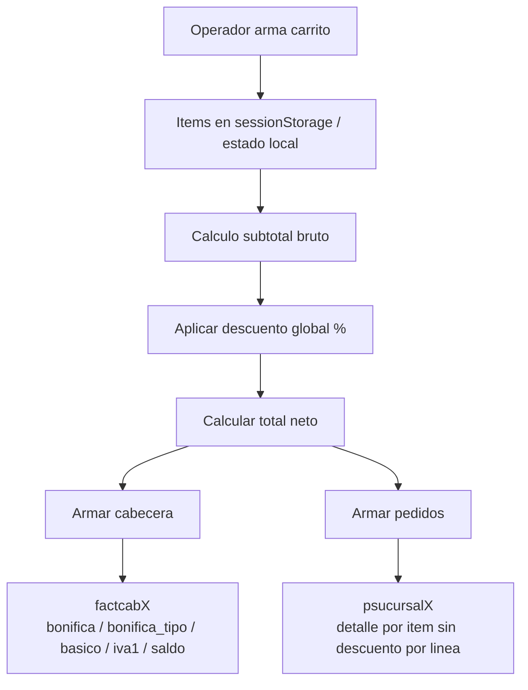
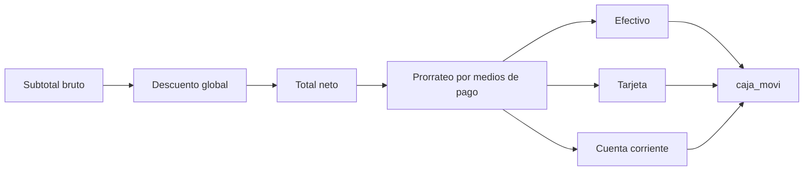
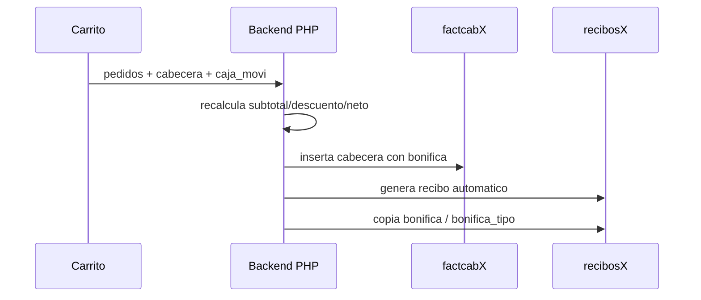
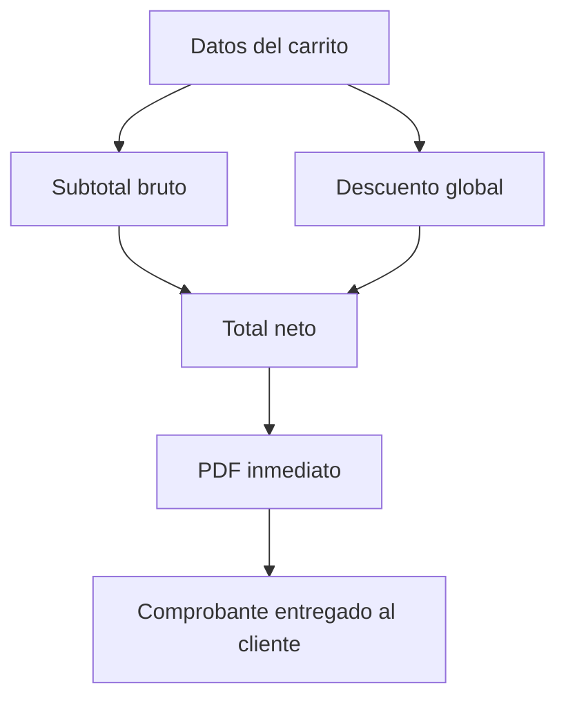
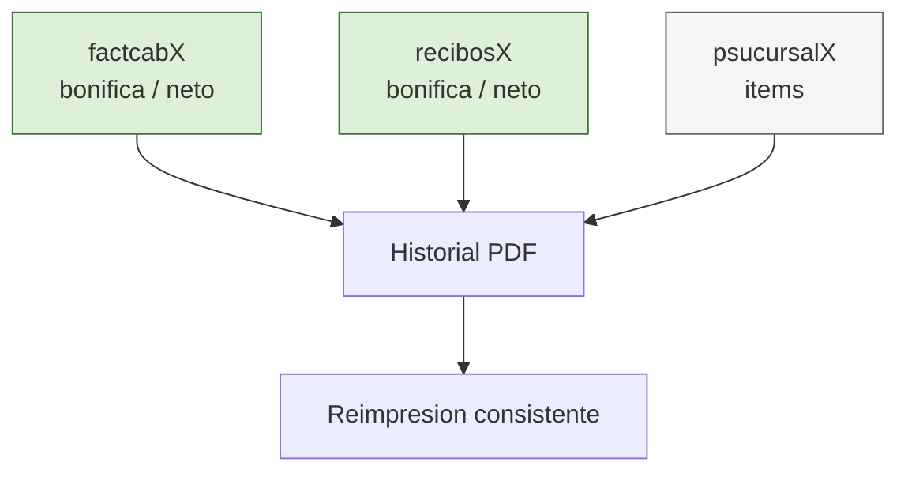
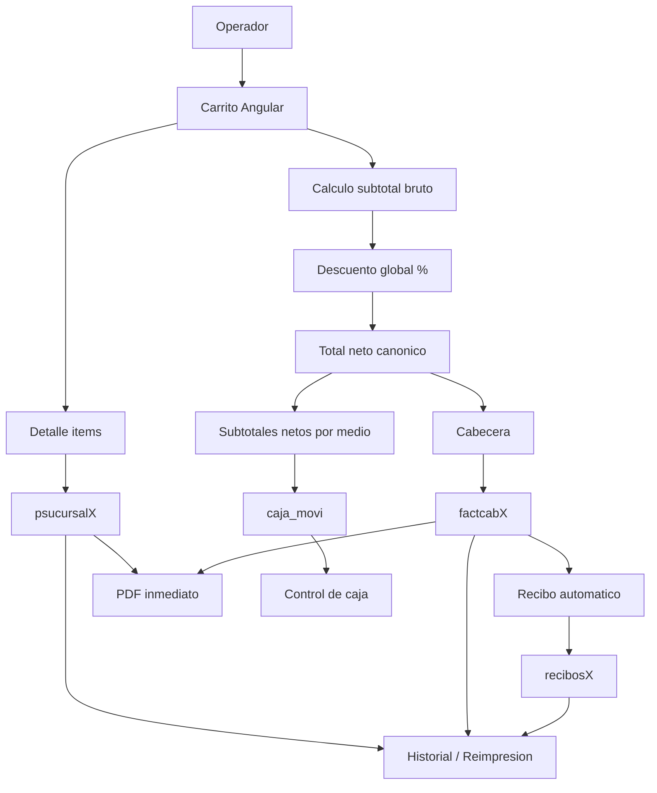

# Flujos asociados a la operacion con descuento

Este documento aclara que flujos quedan contemplados por la propuesta de descuento global en carrito y cuales no.

## 1. Venta principal

- El operador arma items en carrito.
- El carrito calcula `subtotal_bruto`.
- Se aplica `bonifica` global porcentual.
- Se obtiene `total_neto`.
- Se persiste cabecera en `factcabX` con `bonifica`, `bonifica_tipo`, `basico`, `iva1`, `saldo`.

## 2. Caja y medios de pago

- La propuesta si contempla `caja_movi`.
- El descuento no queda como columna nueva en caja.
- El efecto del descuento se refleja en el importe neto de los movimientos.
- Si hay multiples medios de pago, el descuento debe prorratearse entre ellos.

## 3. Recibo automatico asociado

- La propuesta si contempla `recibosX`.
- El backend ya copia `bonifica` y `bonifica_tipo` al recibo automatico.
- Lo que cambia es que el recibo debe reflejar el mismo total neto que la cabecera.

## 4. Comprobante emitido en el momento

- La propuesta si contempla el PDF inmediato.
- El comprobante debe mostrar al menos:
  - subtotal bruto
  - descuento global
  - total neto

## 5. Historial y reimpresion

- La propuesta si contempla historial y reimpresion.
- Este es uno de los puntos mas importantes.
- Hoy el historial recompone total desde items; la propuesta corrige eso.
- La fuente de verdad monetaria debe pasar a ser cabecera/recibo.

## 6. Mapa completo de la operacion

## 7. Que flujos SI quedan contemplados

- Venta principal en `factcabX`.
- Detalle de articulos en `psucursalX`.
- Caja en `caja_movi`.
- Recibo automatico en `recibosX`.
- PDF emitido desde carrito.
- Historial y reimpresion.
- Cuenta corriente, pero solo si el saldo se recalcula sobre el neto y no sobre el bruto.

## 8. Que NO queda cubierto automaticamente

- Reportes externos no revisados que lean solo `psucursalX` y sumen `precio * cantidad`.
- Analiticas o exportaciones legacy que no tomen `bonifica` desde cabecera/recibo.
- Un descuento persistido por linea de item.
- Escenarios futuros de descuento por importe fijo si se decide dejar fase 1 solo en porcentaje.

## 9. Decision clave

La propuesta contempla los flujos operativos asociados a la venta, pero bajo una condicion: el sistema debe dejar de tomar como verdad absoluta la suma de items y pasar a usar un **total neto canonico** compartido por comprobante, recibo, caja e historial.
